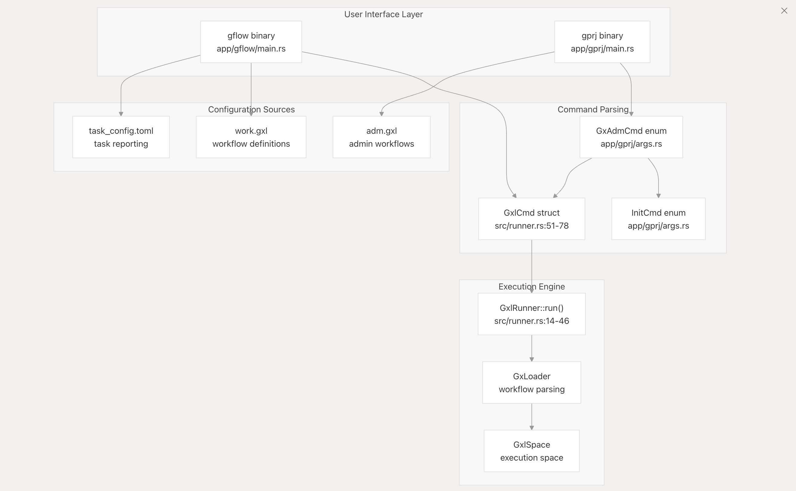

#  Galaxy Flow

Galaxy Flow is a DevSecOps domain-specific language designed for automating security process orchestration and management. It provides a declarative approach to defining workflows through .gxl files that specify environments, flows, and execution sequences for security automation tasks.


Galaxy Flow 是基于环境和工作流组织的DevSecOps领域专用语言，专注于自动化安全流程的编排与管理。
## docs
* [git-docs](https://galaxy-sec.github.io/gxl-docs/)
* [deepwiki](https://deepwiki.com/galaxy-sec/galaxy-flow)

##  下载
项目的正式发布版本可在GitHub发布页面获取：

https://github.com/galaxy-sec/galaxy-flow/releases

## 命令行工具

### 核心命令
```
gflow
gprj
```

#### gflow
对项目定义的工作流（ work.gxl） 运行

#### gprj
对项目定义的管理流（ adm.gxl） 运行


