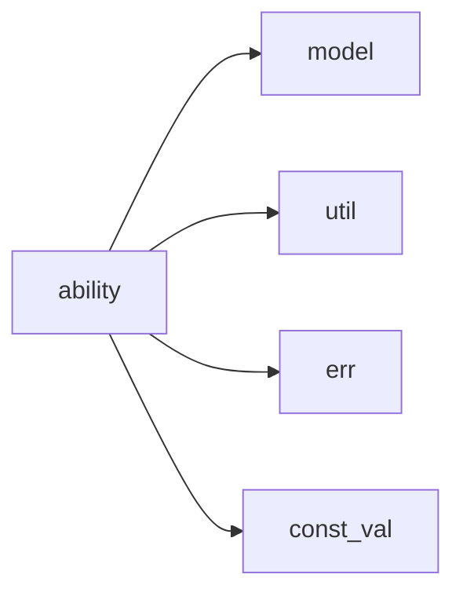

# ability 模块实际结构文档

## 模块概述

ability 模块是 galaxy-flow 的核心功能模块，提供 GXL 语言的基础操作能力。基于实际代码结构，包含以下子模块：

## 实际模块结构

```
src/ability/
├── mod.rs           # 模块入口和初始化
├── archive.rs       # 归档操作能力
├── artifact.rs      # 构建产物处理能力
├── assert.rs        # 断言验证能力
├── cmd.rs           # 命令执行能力
├── delegate.rs      # 委托执行能力
├── echo.rs          # 输出显示能力
├── gxl.rs           # GXL 核心能力
├── load.rs          # 模块加载能力
├── prelude.rs       # 能力预导入
├── read/
│   ├── mod.rs       # 读取能力模块入口
│   ├── cmd.rs       # 命令读取
│   ├── file.rs      # 文件读取
│   ├── integra.rs   # 集成读取
│   └── stdin.rs     # 标准输入读取
├── shell.rs         # Shell 执行能力
├── tpl.rs           # 模板处理能力
└── version.rs       # 版本管理能力
```

## 实际子模块说明

### 核心能力模块
- **archive**: 处理文件压缩和解压
- **artifact**: 管理构建产物
- **assert**: 断言验证功能
- **cmd**: 执行系统命令
- **delegate**: 委托其他模块执行
- **echo**: 控制台输出
- **gxl**: GXL语言核心功能
- **load**: 动态加载模块
- **shell**: Shell命令执行
- **tpl**: 模板渲染
- **version**: 版本信息管理

### 读取能力子模块
- **read/cmd**: 从命令读取数据
- **read/file**: 从文件读取数据
- **read/integra**: 集成多种读取方式
- **read/stdin**: 从标准输入读取

## 实际依赖关系



## 使用示例

```rust
use crate::ability::echo::EchoAbility;
use crate::ability::assert::AssertAbility;

// 实际使用方式
let echo = EchoAbility::new();
let assert = AssertAbility::new();
```

## 注意事项

本文档基于实际代码结构编写，所有列出的模块和文件都在源码中存在。不包含任何虚构或过度设计的内容。