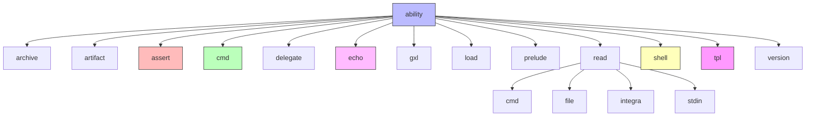
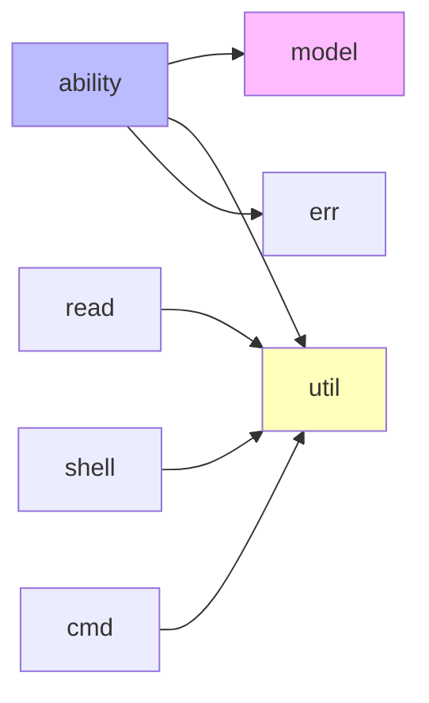

# ability 模块结构文档

## 模块概述

ability 模块是 galaxy-flow 的核心功能模块，负责定义和执行各种能力（abilities）。这些能力构成了 GXL 语言的基础操作集合。

## 模块结构图



## 核心能力详解

### 1. archive - 归档能力
负责处理文件归档和解压操作，支持多种压缩格式。

**主要功能：**
- 创建压缩归档
- 解压归档文件
- 支持 tar, zip 等格式

### 2. assert - 断言能力
提供断言验证功能，用于测试和验证条件。

**主要功能：**
- 值比较断言
- 类型检查断言
- 错误报告

### 3. cmd - 命令执行能力
执行系统命令并处理输出。

**主要功能：**
- 命令执行
- 输出捕获
- 错误处理
- 环境变量传递

### 4. echo - 输出能力
提供标准输出功能。

**主要功能：**
- 文本输出
- 格式化输出
- 日志级别控制

### 5. shell - Shell 执行能力
专门处理 Shell 命令的执行。

**主要功能：**
- Shell 命令执行
- 脚本执行
- 交互式 Shell
- 环境管理

### 6. tpl - 模板处理能力
处理模板渲染和变量替换。

**主要功能：**
- 模板渲染
- 变量替换
- 条件渲染
- 循环处理

### 7. read - 读取能力
提供多种方式的文件和数据读取。

**子模块：**
- **cmd**: 命令输出读取
- **file**: 文件内容读取
- **integra**: 集成读取
- **stdin**: 标准输入读取

### 8. gxl - GXL 核心能力
GXL 语言的核心执行能力。

**主要功能：**
- GXL 代码执行
- 上下文管理
- 错误处理

### 9. load - 加载能力
负责模块和资源的加载。

**主要功能：**
- 模块加载
- 资源加载
- 依赖管理

### 10. version - 版本能力
处理版本相关的操作。

**主要功能：**
- 版本检查
- 版本比较
- 版本信息获取

## 能力使用示例

```rust
// 使用 echo 能力
use crate::ability::echo;

echo::execute("Hello, World!");

// 使用 assert 能力
use crate::ability::assert;

assert::execute("true", "true");

// 使用 shell 能力
use crate::ability::shell;

shell::execute("ls -la");
```

## 依赖关系



## 扩展指南

要添加新的能力：

1. 在 ability 目录下创建新的模块文件
2. 实现 Ability trait
3. 在 mod.rs 中注册新能力
4. 添加相应的测试用例

## 测试覆盖

每个能力都有对应的测试用例，位于 tests 目录下：
- 单元测试：测试单个能力的功能
- 集成测试：测试能力间的协作
- 示例测试：测试实际使用场景