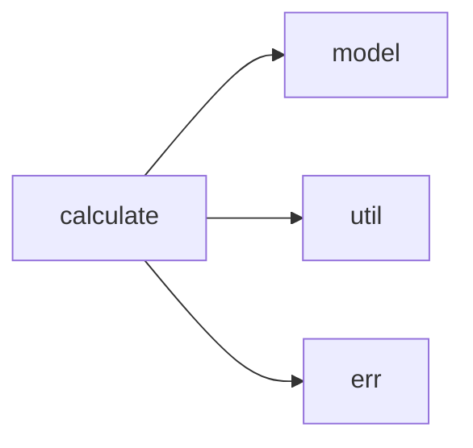

# calculate 模块实际结构文档

## 模块概述

calculate 模块提供表达式计算和逻辑运算能力，基于实际代码结构包含以下子模块：

## 实际模块结构

```
src/calculate/
├── mod.rs           # 模块入口
├── compare.rs       # 比较运算
├── cond.rs          # 条件运算
├── defined.rs       # 定义检查
├── dynval.rs        # 动态值处理
├── express.rs       # 表达式计算
├── logic.rs         # 逻辑运算
└── traits.rs        # 计算特质定义
```

## 实际子模块说明

### 计算核心模块
- **compare**: 提供比较运算功能（等于、大于、小于等）
- **cond**: 条件表达式处理
- **defined**: 检查变量或表达式是否已定义
- **dynval**: 处理动态值和运行时值
- **express**: 表达式解析和计算引擎
- **logic**: 逻辑运算（与、或、非等）
- **traits**: 定义计算相关的特质接口

## 实际导出接口

```rust
pub use compare::CmpExpress;
pub use express::ExpressEnum;
pub use traits::Evaluation;
```

## 使用示例

```rust
use crate::calculate::ExpressEnum;
use crate::calculate::Evaluation;

// 实际使用方式
let expr = ExpressEnum::parse("1 + 2 * 3")?;
let result = expr.evaluate(&context)?;
```

## 实际依赖关系



## 注意事项

本文档基于实际代码结构，所有列出的模块都在源码中存在。calculate模块相对简单，专注于表达式计算功能。