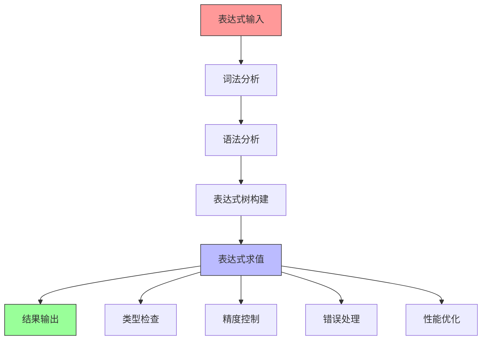
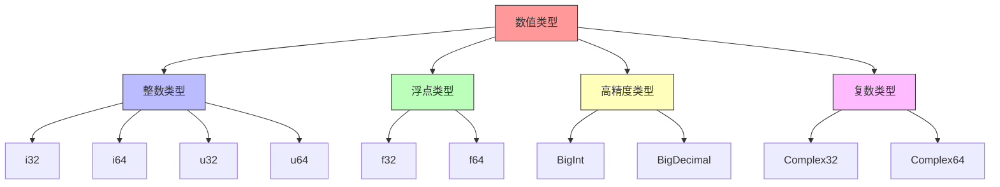
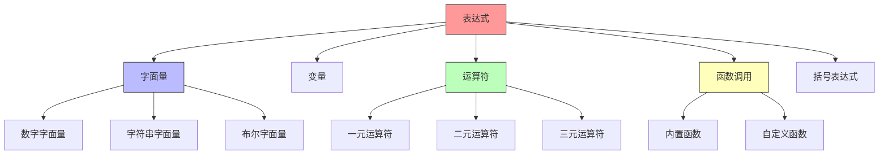
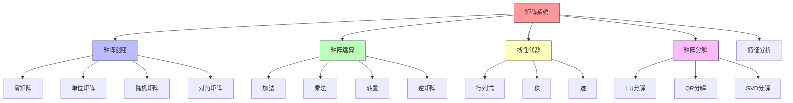
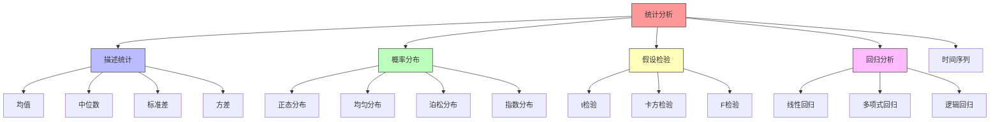
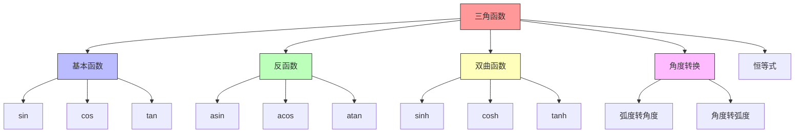
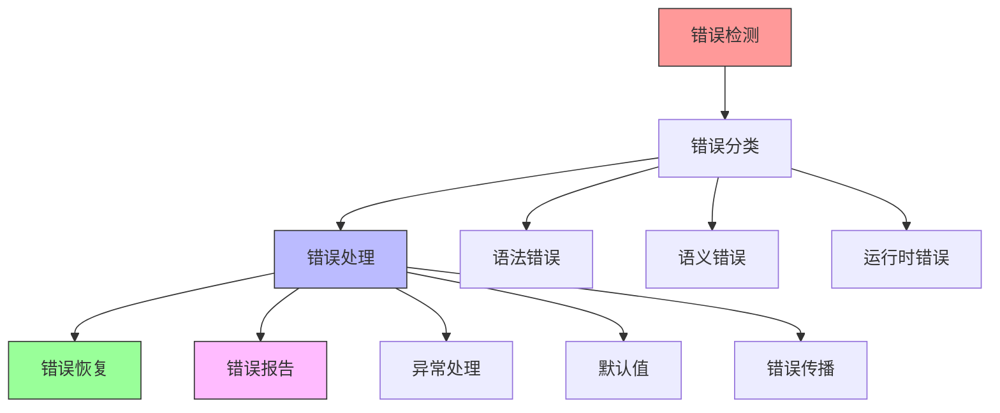
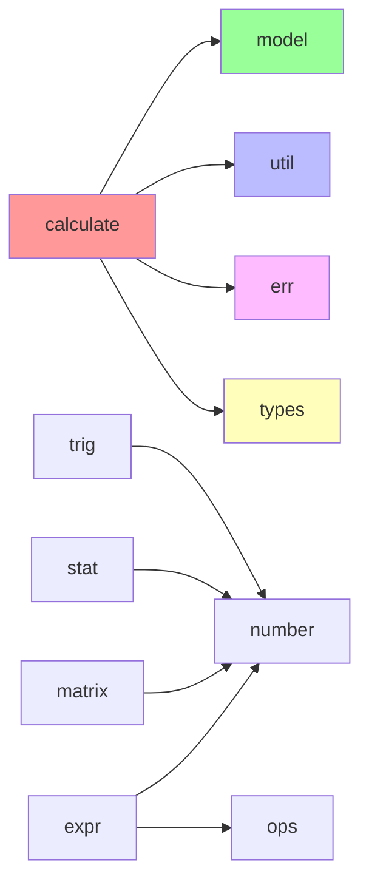

# calculate 模块结构文档

## 模块概述

calculate 模块是 galaxy-flow 的计算引擎核心，负责处理 GXL 语言中的数学计算、表达式求值、数值运算和统计分析功能。它提供了完整的数学计算框架，支持基本运算、高级数学函数、统计分析、矩阵运算等多种计算需求。

## 模块结构图

```mermaid
graph TD
    A[calculate] --> B[base]
    A --> C[expr]
    A --> D[func]
    A --> E[matrix]
    A --> F[number]
    A --> G[ops]
    A --> H[stat]
    A --> I[trig]
    A --> J[util]
    A --> K[validate]

    B --> B1[base_ops]
    B --> B2[constants]
    B --> B3[conversions]

    C --> C1[expr_parser]
    C --> C2[expr_eval]
    C --> C3[expr_simplify]

    D --> D1[math_funcs]
    D --> D2[stat_funcs]
    D --> D3[trig_funcs]

    E --> E1[matrix_ops]
    E --> E2[matrix_algebra]
    E --> E3[linear_algebra]

    F --> F1[number_type]
    F --> F2[precision]
    F --> F3[rounding]

    G --> G1[arithmetic]
    G --> G2[comparison]
    G --> G3[logical]

    H --> H1[descriptive]
    H --> H2[distributions]
    H --> H3[regression]

    I --> I1[trig_basic]
    I --> I2[trig_inverse]
    I --> I3[hyperbolic]

    style A fill:#f99,stroke:#333
    style C fill:#bbf,stroke:#333
    style D fill:#bfb,stroke:#333
    style E fill:#ffb,stroke:#333
    style F fill:#fbf,stroke:#333
    style H fill:#f9f,stroke:#333
```



## 计算架构

### 整体计算流程



## 核心计算组件

### 1. 表达式引擎 (expr)
负责表达式的解析、求值和简化。

**主要功能：**
- 表达式解析
- 表达式求值
- 表达式简化
- 表达式验证
- 表达式优化

**子模块：**
- **expr_parser**: 表达式解析器
- **expr_eval**: 表达式求值器
- **expr_simplify**: 表达式简化器

### 2. 数学函数库 (func)
提供各种数学函数的实现。

**主要功能：**
- 基础数学函数
- 统计函数
- 三角函数
- 特殊函数
- 自定义函数

**子模块：**
- **math_funcs**: 数学函数
- **stat_funcs**: 统计函数
- **trig_funcs**: 三角函数

### 3. 矩阵运算 (matrix)
提供矩阵运算和线性代数功能。

**主要功能：**
- 矩阵创建
- 矩阵运算
- 线性代数
- 矩阵分解
- 特征值计算

**子模块：**
- **matrix_ops**: 矩阵操作
- **matrix_algebra**: 矩阵代数
- **linear_algebra**: 线性代数

### 4. 数值类型 (number)
管理数值类型和精度控制。

**主要功能：**
- 数值类型定义
- 精度控制
- 舍入处理
- 类型转换
- 数值验证

**子模块：**
- **number_type**: 数值类型
- **precision**: 精度控制
- **rounding**: 舍入处理

### 5. 运算符 (ops)
定义和实现各种运算符。

**主要功能：**
- 算术运算
- 比较运算
- 逻辑运算
- 位运算
- 自定义运算

**子模块：**
- **arithmetic**: 算术运算
- **comparison**: 比较运算
- **logical**: 逻辑运算

### 6. 统计分析 (stat)
提供统计分析功能。

**主要功能：**
- 描述统计
- 概率分布
- 回归分析
- 假设检验
- 数据采样

**子模块：**
- **descriptive**: 描述统计
- **distributions**: 概率分布
- **regression**: 回归分析

### 7. 三角函数 (trig)
提供三角函数和反三角函数。

**主要功能：**
- 基本三角函数
- 反三角函数
- 双曲函数
- 角度转换
- 三角恒等式

**子模块：**
- **trig_basic**: 基本三角函数
- **trig_inverse**: 反三角函数
- **hyperbolic**: 双曲函数

## 数值类型系统

### 数值类型层次



### 数值类型定义

```rust
pub enum Number {
    Integer(i64),
    Float(f64),
    BigInt(BigInt),
    BigDecimal(BigDecimal),
    Complex(Complex64),
}

pub struct Precision {
    pub scale: u32,
    pub rounding_mode: RoundingMode,
}

pub enum RoundingMode {
    Up,
    Down,
    HalfUp,
    HalfDown,
    HalfEven,
}
```

## 表达式系统

### 表达式结构



### 表达式树结构

```rust
pub enum Expr {
    Number(Number),
    Variable(String),
    UnaryOp(UnaryOp, Box<Expr>),
    BinaryOp(BinaryOp, Box<Expr>, Box<Expr>),
    FunctionCall(String, Vec<Expr>),
    Paren(Box<Expr>),
}

pub enum UnaryOp {
    Plus,
    Minus,
    Not,
}

pub enum BinaryOp {
    Add,
    Subtract,
    Multiply,
    Divide,
    Modulo,
    Power,
    Equal,
    NotEqual,
    LessThan,
    GreaterThan,
    And,
    Or,
}
```

## 矩阵运算系统

### 矩阵结构



### 矩阵定义

```rust
pub struct Matrix {
    pub rows: usize,
    pub cols: usize,
    pub data: Vec<Vec<f64>>,
}

impl Matrix {
    pub fn new(rows: usize, cols: usize) -> Self;
    pub fn identity(size: usize) -> Self;
    pub fn transpose(&self) -> Self;
    pub fn inverse(&self) -> Option<Self>;
    pub fn determinant(&self) -> f64;
    pub fn eigenvalues(&self) -> Vec<f64>;
}
```

## 统计分析系统

### 统计功能结构



### 统计函数

```rust
pub struct Statistics {
    pub data: Vec<f64>,
}

impl Statistics {
    pub fn mean(&self) -> f64;
    pub fn median(&self) -> f64;
    pub fn mode(&self) -> Option<f64>;
    pub fn variance(&self) -> f64;
    pub fn standard_deviation(&self) -> f64;
    pub fn percentile(&self, p: f64) -> f64;
    pub fn correlation(&self, other: &Self) -> f64;
}
```

## 三角函数系统

### 三角函数结构



### 三角函数实现

```rust
pub struct Trigonometry;

impl Trigonometry {
    pub fn sin(x: f64) -> f64;
    pub fn cos(x: f64) -> f64;
    pub fn tan(x: f64) -> f64;
    pub fn asin(x: f64) -> f64;
    pub fn acos(x: f64) -> f64;
    pub fn atan(x: f64) -> f64;
    pub fn sinh(x: f64) -> f64;
    pub fn cosh(x: f64) -> f64;
    pub fn tanh(x: f64) -> f64;
    pub fn to_degrees(radians: f64) -> f64;
    pub fn to_radians(degrees: f64) -> f64;
}
```

## 基础工具

### 1. 基础运算 (base)
提供基础数学运算。

**主要功能：**
- 基础运算
- 数学常量
- 类型转换
- 数值验证

**子模块：**
- **base_ops**: 基础运算
- **constants**: 数学常量
- **conversions**: 类型转换

### 2. 计算工具 (util)
提供计算相关的工具函数。

**主要功能：**
- 计算工具
- 辅助函数
- 性能优化
- 错误处理

### 3. 验证工具 (validate)
提供计算结果的验证功能。

**主要功能：**
- 结果验证
- 精度检查
- 范围验证
- 错误检测

## 使用示例

### 1. 基础计算

```rust
use crate::calculate::expr::ExprEvaluator;
use crate::calculate::number::Number;

// 创建表达式求值器
let evaluator = ExprEvaluator::new();

// 计算表达式
let result = evaluator.evaluate("2 + 3 * 4")?;
assert_eq!(result, Number::Integer(14));
```

### 2. 矩阵运算

```rust
use crate::calculate::matrix::Matrix;

// 创建矩阵
let a = Matrix::from_vec(vec![
    vec![1.0, 2.0],
    vec![3.0, 4.0],
]);

let b = Matrix::from_vec(vec![
    vec![5.0, 6.0],
    vec![7.0, 8.0],
]);

// 矩阵乘法
let c = a.multiply(&b)?;
```

### 3. 统计分析

```rust
use crate::calculate::stat::Statistics;

// 创建统计数据
let data = vec![1.0, 2.0, 3.0, 4.0, 5.0];
let stats = Statistics::new(data);

// 计算统计量
let mean = stats.mean();
let std_dev = stats.standard_deviation();
```

### 4. 三角函数

```rust
use crate::calculate::trig::Trigonometry;

// 计算三角函数
let sin_30 = Trigonometry::sin(30.0_f64.to_radians());
let cos_60 = Trigonometry::cos(60.0_f64.to_radians());
```

### 5. 高精度计算

```rust
use crate::calculate::number::{BigDecimal, Precision};

// 高精度计算
let a = BigDecimal::from_str("123.4567890123456789")?;
let b = BigDecimal::from_str("987.6543210987654321")?;
let result = a.multiply(&b)?;
```

## 性能优化

### 1. 算法优化
- 快速傅里叶变换
- 矩阵分解优化
- 数值稳定性
- 缓存优化

### 2. 并行计算
- 矩阵运算并行
- 统计计算并行
- 表达式求值并行
- 批处理优化

### 3. 内存优化
- 对象池
- 内存复用
- 零拷贝操作
- 缓存友好

## 精度控制

### 精度管理

```rust
pub struct PrecisionConfig {
    pub decimal_places: u32,
    pub rounding_mode: RoundingMode,
    pub precision_mode: PrecisionMode,
}

pub enum PrecisionMode {
    Fixed,
    Scientific,
    Engineering,
    General,
}

pub enum RoundingMode {
    Up,
    Down,
    HalfUp,
    HalfDown,
    HalfEven,
    Ceiling,
    Floor,
}
```

## 错误处理

### 计算错误类型

```rust
pub enum CalculateError {
    ParseError(String),
    EvaluationError(String),
    DivisionByZero,
    Overflow,
    Underflow,
    InvalidArgument(String),
    MatrixError(String),
    PrecisionError(String),
    DomainError(String),
    RangeError(String),
}
```

### 错误处理策略



## 依赖关系



## 扩展指南

要添加新的计算功能：

1. 在calculate目录下创建新的计算模块
2. 实现计算接口
3. 添加单元测试
4. 更新文档和示例
5. 添加性能测试
6. 添加精度测试

## 测试策略

- **单元测试**: 测试单个计算函数
- **集成测试**: 测试计算组合
- **精度测试**: 测试计算精度
- **边界测试**: 测试边界条件
- **性能测试**: 测试计算性能
- **并发测试**: 测试并发计算
- **错误测试**: 测试错误处理

## 性能基准

### 计算性能指标

```rust
pub struct PerformanceMetrics {
    pub operation_count: u64,
    pub execution_time: Duration,
    pub memory_usage: usize,
    pub cache_hit_rate: f64,
    pub precision_loss: f64,
}

pub struct BenchmarkResult {
    pub test_name: String,
    pub metrics: PerformanceMetrics,
    pub comparison: Vec<ComparisonResult>,
}
```

### 优化建议

1. **算法选择**: 选择最优算法
2. **缓存策略**: 合理使用缓存
3. **并行计算**: 利用多核CPU
4. **内存管理**: 减少内存分配
5. **精度控制**: 平衡精度和性能

## 使用场景

### 1. 科学计算
- 数值分析
- 统计分析
- 矩阵运算
- 微积分计算

### 2. 工程计算
- 信号处理
- 控制系统
- 优化算法
- 仿真计算

### 3. 数据分析
- 数据清洗
- 特征工程
- 模型训练
- 结果验证

### 4. 金融计算
- 风险评估
- 投资组合
- 期权定价
- 统计分析