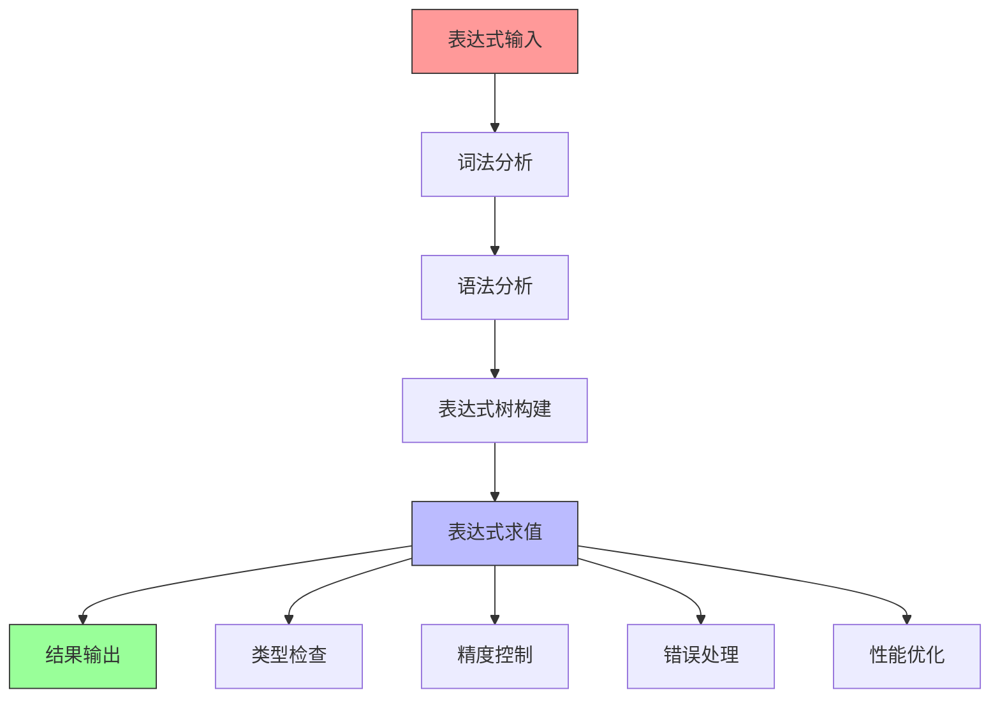

# calculate 模块结构文档

## 模块概述

calculate 模块是 galaxy-flow 的计算引擎核心，负责处理 GXL 语言中的数学计算、表达式求值、数值运算和统计分析功能。它提供了完整的数学计算框架，支持基本运算、高级数学函数、统计分析、矩阵运算等多种计算需求。

## 模块结构图

```mermaid
graph TD
    A[calculate] --> B[base]
    A --> C[expr]
    A --> D[func]
    A --> E[matrix]
    A --> F[number]
    A --> G[ops]
    A --> H[stat]
    A --> I[trig]
    A --> J[util]
    A --> K[validate]

    B --> B1[base_ops]
    B --> B2[constants]
    B --> B3[conversions]

    C --> C1[expr_parser]
    C --> C2[expr_eval]
    C --> C3[expr_simplify]

    D --> D1[math_funcs]
    D --> D2[stat_funcs]
    D --> D3[trig_funcs]

    E --> E1[matrix_ops]
    E --> E2[matrix_algebra]
    E --> E3[linear_algebra]

    F --> F1[number_type]
    F --> F2[precision]
    F --> F3[rounding]

    G --> G1[arithmetic]
    G --> G2[comparison]
    G --> G3[logical]

    H --> H1[descriptive]
    H --> H2[distributions]
    H --> H3[regression]

    I --> I1[trig_basic]
    I --> I2[trig_inverse]
    I --> I3[hyperbolic]

    style A fill:#f99,stroke:#333
    style C fill:#bbf,stroke:#333
    style D fill:#bfb,stroke:#333
    style E fill:#ffb,stroke:#333
    style F fill:#fbf,stroke:#333
    style H fill:#f9f,stroke:#333
```

## 计算架构

### 整体计算流程

## 核心计算组件

### 1. 表达式引擎 (expr)
负责表达式的解析、求值和简化。

**主要功能：**
- 表达式解析
- 表达式求值
- 表达式简化
- 表达式验证
- 表达式优化

**子模块：**
- **expr_parser**: 表达式解析器
- **expr_eval**: 表达式求值器
- **expr_simplify**: 表达式简化器

