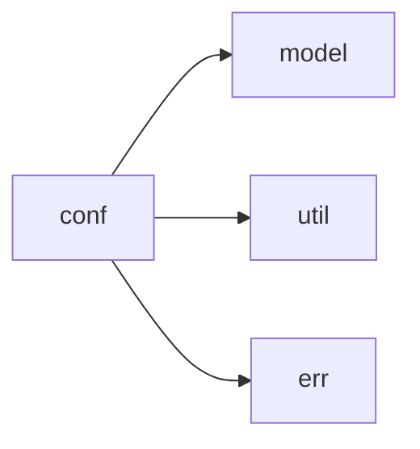

# conf 模块实际结构文档

## 模块概述

conf 模块负责配置管理，基于实际代码结构包含以下子模块：

## 实际模块结构

```
src/conf/
├── mod.rs           # 模块入口
├── gxlconf.rs       # GXL配置定义
├── mod_test.rs      # 配置测试
└── oprator.rs       # 配置操作
```

## 实际子模块说明

- **gxlconf**: GXL配置文件结构和解析
- **oprator**: 配置操作和处理的工具函数
- **mod_test**: 配置模块的单元测试

## 实际依赖关系



## 使用示例

```rust
use crate::conf::gxlconf::GxlConf;

// 实际使用方式
let config = GxlConf::load_from_file("config.toml")?;
```