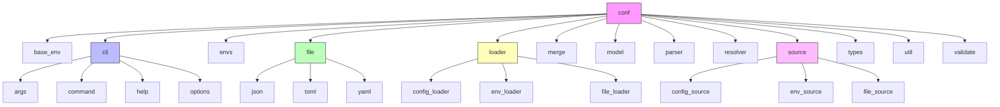
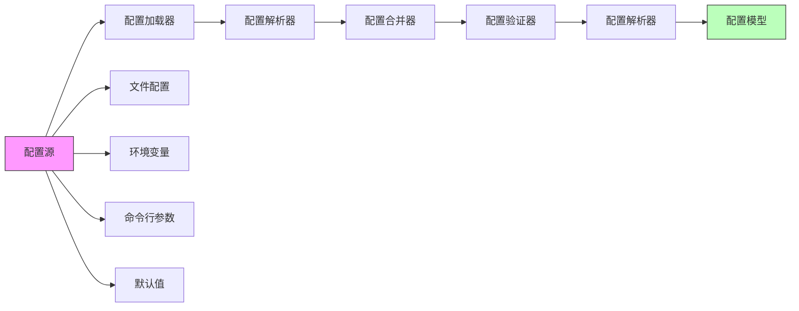
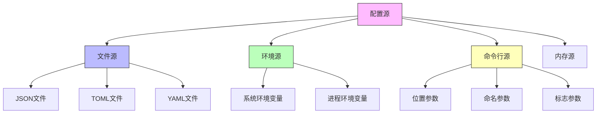
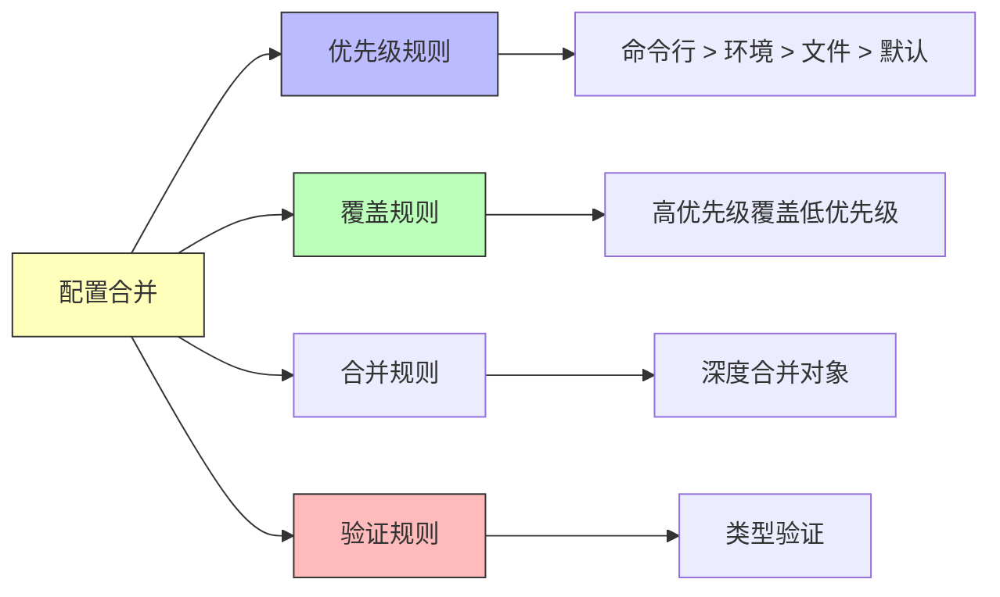
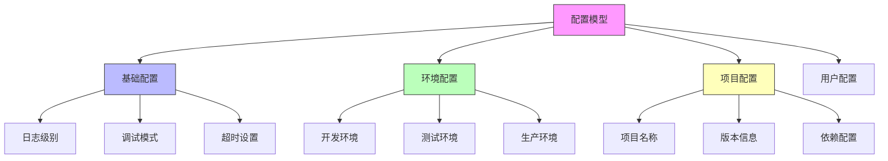
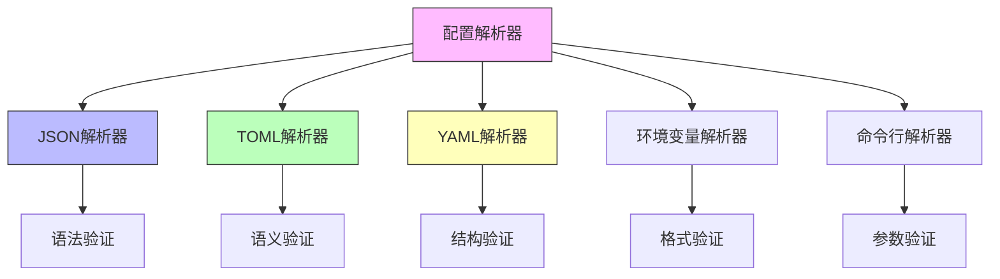
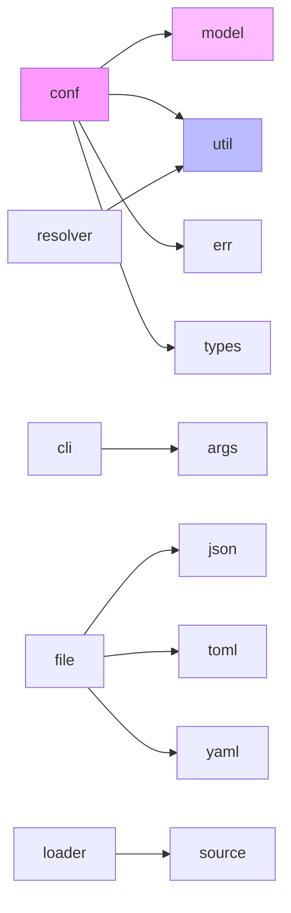

# conf 模块结构文档

## 模块概述

conf 模块是 galaxy-flow 的配置管理核心，负责处理 GXL 项目的配置文件、环境变量、命令行参数等各种配置源。它提供了统一的配置接口，支持多环境配置、配置继承、动态配置更新等功能。

## 模块结构图



## 配置架构

### 整体配置流程



## 核心配置组件

### 1. 基础环境 (base_env)
定义基础环境配置模板。

**主要功能：**
- 基础环境定义
- 通用配置模板
- 环境继承机制
- 默认配置值

### 2. 命令行接口 (cli)
处理命令行参数和选项。

**子模块：**
- **args**: 参数解析
- **command**: 命令定义
- **help**: 帮助信息
- **options**: 选项处理

### 3. 环境配置 (envs)
管理不同环境的配置。

**主要功能：**
- 环境定义
- 环境切换
- 环境继承
- 环境变量映射

### 4. 文件配置 (file)
处理各种格式的配置文件。

**支持的格式：**
- **JSON**: 结构化配置
- **TOML**: 人类可读配置
- **YAML**: 层次化配置

### 5. 配置加载器 (loader)
统一配置加载接口。

**主要加载器：**
- **config_loader**: 通用配置加载
- **env_loader**: 环境变量加载
- **file_loader**: 文件配置加载

## 配置源管理

### 配置源结构



### 1. 配置源 (config_source)
定义配置数据的来源。

**主要功能：**
- 配置源接口
- 优先级管理
- 动态更新
- 缓存机制

### 2. 环境源 (env_source)
从环境变量获取配置。

**主要功能：**
- 环境变量读取
- 前缀过滤
- 类型转换
- 默认值处理

### 3. 文件源 (file_source)
从配置文件获取配置。

**主要功能：**
- 文件监控
- 格式检测
- 热重载
- 错误处理

## 配置合并策略

### 合并规则



### 1. 合并器 (merge)
处理配置的合并逻辑。

**主要功能：**
- 深度合并
- 数组合并
- 对象合并
- 冲突解决

### 2. 验证器 (validate)
验证配置的有效性。

**主要功能：**
- 类型验证
- 范围验证
- 依赖验证
- 格式验证

## 配置模型

### 配置数据结构



### 1. 配置模型 (model)
定义配置的数据结构。

**主要结构：**
- 基础配置
- 环境配置
- 项目配置
- 用户配置
- 系统配置

### 2. 配置解析器 (parser)
解析配置文件内容。

**主要功能：**
- 语法解析
- 语义分析
- 错误报告
- 位置信息

## 配置解析器

### 解析器架构



## 配置工具

### 1. 配置工具 (util)
提供配置处理的工具函数。

**主要功能：**
- 路径处理
- 默认值设置
- 类型转换
- 格式化输出

### 2. 配置解析器 (resolver)
解析配置引用和变量。

**主要功能：**
- 变量替换
- 配置引用
- 环境变量解析
- 路径解析

## 配置类型

### 配置类型系统

```rust
pub enum ConfigValue {
    String(String),
    Number(f64),
    Boolean(bool),
    Array(Vec<ConfigValue>),
    Object(HashMap<String, ConfigValue>),
    Null,
}

pub struct Config {
    pub base: BaseConfig,
    pub environments: HashMap<String, EnvironmentConfig>,
    pub project: ProjectConfig,
    pub user: UserConfig,
}
```

## 使用示例

### 1. 基础配置加载

```rust
use crate::conf::{
    loader::ConfigLoader,
    model::Config,
    source::ConfigSource
};

// 创建配置加载器
let loader = ConfigLoader::new();

// 添加配置源
loader.add_source(ConfigSource::File("config.toml"));
loader.add_source(ConfigSource::Env);
loader.add_source(ConfigSource::Args);

// 加载配置
let config = loader.load()?;
```

### 2. 环境配置

```rust
use crate::conf::{
    envs::Environment,
    loader::ConfigLoader
};

// 设置环境
let env = Environment::Development;

// 加载环境配置
let config = ConfigLoader::new()
    .with_environment(env)
    .load()?;
```

### 3. 命令行配置

```rust
use crate::conf::cli::{
    Args,
    Command,
    Options
};

// 解析命令行参数
let args = Args::parse();
let command = Command::from_args(&args);
let options = Options::from_args(&args);
```

## 配置验证

### 验证规则

```rust
pub struct ValidationRule {
    pub field: String,
    pub rule_type: ValidationType,
    pub required: bool,
    pub default: Option<ConfigValue>,
}

pub enum ValidationType {
    Type(ConfigType),
    Range(f64, f64),
    Length(usize, usize),
    Pattern(String),
    Enum(Vec<String>),
}
```

## 依赖关系



## 扩展指南

要添加新的配置功能：

1. 在相应目录创建新的配置模块
2. 实现 ConfigSource trait
3. 添加配置验证规则
4. 更新配置模型
5. 添加单元测试
6. 更新文档和示例

## 测试策略

- **单元测试**: 测试单个配置组件
- **集成测试**: 测试配置加载流程
- **环境测试**: 测试不同环境下的配置
- **格式测试**: 测试不同配置格式的解析
- **验证测试**: 测试配置验证规则
- **性能测试**: 测试配置加载性能