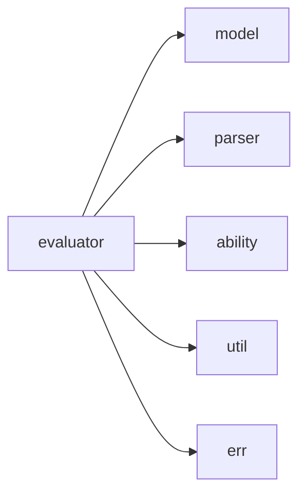

# evaluator 模块实际结构文档

## 模块概述

evaluator 模块负责执行解析后的GXL代码，基于实际代码结构包含以下子模块：

## 实际模块结构

```
src/evaluator/
├── mod.rs           # 模块入口
└── runner.rs        # 执行器实现
```

## 实际子模块说明

- **runner**: GXL代码执行器，负责执行解析后的模型对象

## 实际依赖关系



## 使用示例

```rust
use crate::evaluator::runner::Runner;
use crate::model::gxl_mod::GxlMod;

// 实际使用方式
let runner = Runner::new();
let result = runner.execute_module(&module)?;
```