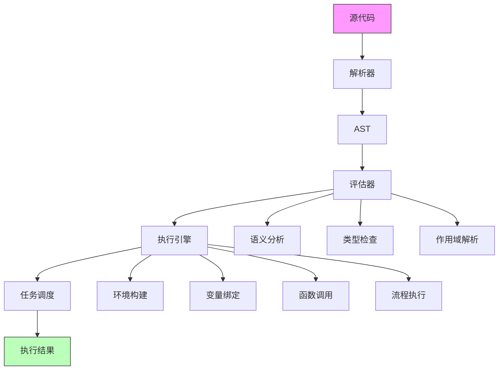
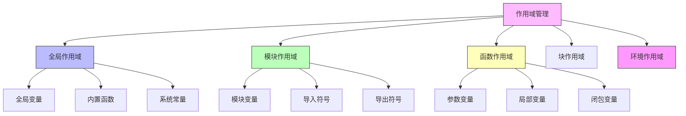
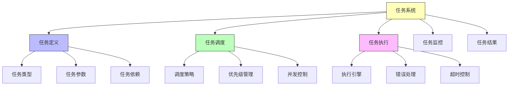
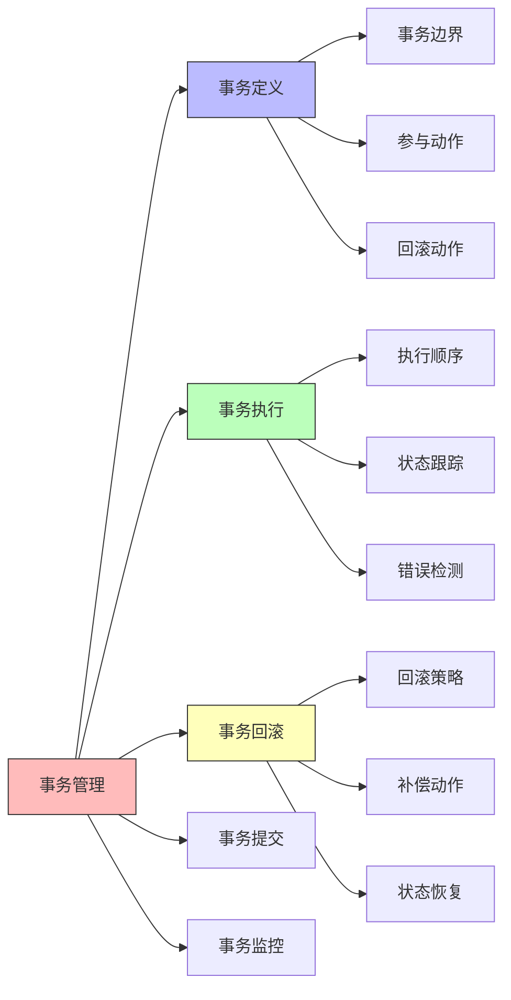
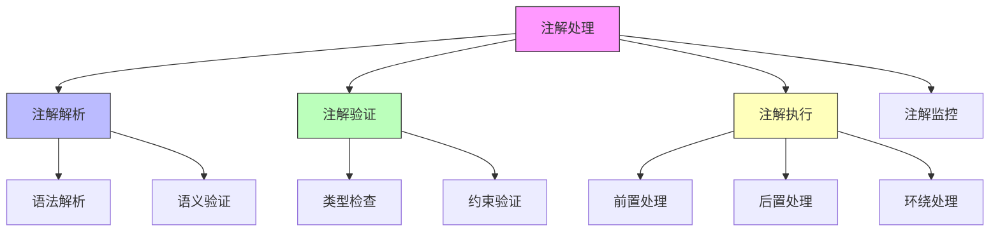
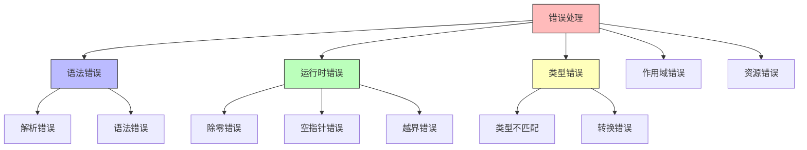
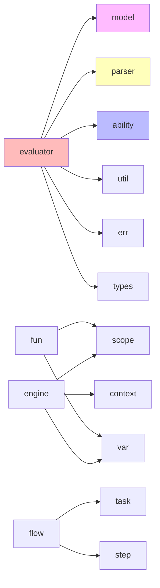

# evaluator 模块结构文档

## 模块概述

evaluator 模块是 galaxy-flow 的执行引擎核心，负责将解析后的 GXL AST（抽象语法树）转换为可执行的任务，并协调各个模块完成实际的执行过程。它实现了 GXL 语言的运行时环境，包括变量作用域管理、函数调用、流程执行、错误处理等核心功能。

## 模块结构图

```mermaid
graph TD
    A[evaluator] --> B[act]
    A --> C[ann]
    A --> D[context]
    A --> E[engine]
    A --> F[env]
    A --> G[error]
    A --> H[eval]
    A --> I[flow]
    A --> J[fun]
    A --> K[mod]
    A --> L[scope]
    A --> M[step]
    A --> N[task]
    A --> O[trans]
    A --> P[util]
    A --> Q[var]

    B --> B1[action_executor]
    B --> B2[action_registry]

    E --> E1[engine_core]
    E --> E2[engine_state]

    F --> F1[env_builder]
    F --> F2[env_resolver]

    H --> H1[evaluator_core]
    H --> H2[evaluator_state]

    I --> I1[flow_builder]
    I --> I2[flow_executor]

    J --> J1[fun_builder]
    J --> J2[fun_executor]

    K --> K1[mod_builder]
    K --> K2[mod_executor]

    style A fill:#fbb,stroke:#333
    style E fill:#bbf,stroke:#333
    style H fill:#bfb,stroke:#333
    style I fill:#ffb,stroke:#333
    style J fill:#fbf,stroke:#333
    style K fill:#f9f,stroke:#333
```



## 执行引擎架构

### 整体执行流程



## 核心执行组件

### 1. 执行引擎 (engine)
GXL 语言的核心执行引擎。

**主要功能：**
- AST 遍历执行
- 执行状态管理
- 错误处理
- 性能监控
- 调试支持

**子模块：**
- **engine_core**: 核心执行逻辑
- **engine_state**: 执行状态管理

### 2. 评估器 (eval)
负责表达式的求值和计算。

**主要功能：**
- 表达式求值
- 类型转换
- 运算符重载
- 函数调用
- 变量解析

**子模块：**
- **evaluator_core**: 核心评估逻辑
- **evaluator_state**: 评估状态管理

### 3. 动作执行器 (act)
执行各种 GXL 动作。

**主要功能：**
- 动作注册
- 动作调度
- 参数验证
- 结果处理
- 错误恢复

**子模块：**
- **action_executor**: 动作执行逻辑
- **action_registry**: 动作注册管理

### 4. 环境管理器 (env)
管理执行环境和变量作用域。

**主要功能：**
- 环境创建
- 变量绑定
- 作用域链管理
- 环境继承
- 配置解析

**子模块：**
- **env_builder**: 环境构建器
- **env_resolver**: 环境解析器

### 5. 流程执行器 (flow)
执行 GXL 流程定义。

**主要功能：**
- 流程构建
- 步骤执行
- 条件判断
- 循环处理
- 并行执行

**子模块：**
- **flow_builder**: 流程构建器
- **flow_executor**: 流程执行器

### 6. 函数执行器 (fun)
执行 GXL 函数调用。

**主要功能：**
- 函数构建
- 参数绑定
- 函数调用
- 返回值处理
- 闭包支持

**子模块：**
- **fun_builder**: 函数构建器
- **fun_executor**: 函数执行器

### 7. 模块执行器 (mod)
执行 GXL 模块定义。

**主要功能：**
- 模块构建
- 导入处理
- 导出管理
- 模块初始化
- 依赖解析

**子模块：**
- **mod_builder**: 模块构建器
- **mod_executor**: 模块执行器

## 作用域管理

### 作用域结构



### 1. 作用域管理器 (scope)
管理变量作用域和生命周期。

**主要功能：**
- 作用域创建
- 变量查找
- 作用域链构建
- 变量遮蔽处理
- 垃圾回收

### 2. 变量管理器 (var)
管理变量的存储和访问。

**主要功能：**
- 变量定义
- 变量赋值
- 变量读取
- 类型检查
- 生命周期管理

## 任务执行系统

### 任务结构



### 1. 任务管理器 (task)
管理任务的创建和执行。

**主要功能：**
- 任务创建
- 任务调度
- 任务执行
- 任务监控
- 任务结果收集

### 2. 步骤执行器 (step)
执行流程中的单个步骤。

**主要功能：**
- 步骤定义
- 步骤执行
- 步骤状态管理
- 步骤结果处理
- 步骤错误处理

## 事务管理

### 事务结构



### 事务执行器 (trans)
管理事务的执行和回滚。

**主要功能：**
- 事务定义
- 事务执行
- 事务回滚
- 事务提交
- 事务监控

## 注解处理

### 注解结构



### 注解处理器 (ann)
处理 GXL 注解的执行。

**主要功能：**
- 注解解析
- 注解验证
- 注解执行
- 注解监控
- 注解扩展

## 错误处理

### 错误结构



### 错误处理器 (error)
统一处理执行过程中的错误。

**主要功能：**
- 错误捕获
- 错误分类
- 错误报告
- 错误恢复
- 调试信息

## 执行工具

### 1. 执行工具 (util)
提供执行过程中的工具函数。

**主要功能：**
- 日志记录
- 性能监控
- 调试支持
- 缓存管理
- 工具函数

## 执行状态管理

### 状态结构

```rust
pub struct ExecutionState {
    pub global_scope: Scope,
    pub current_module: Option<ModuleId>,
    pub call_stack: Vec<CallFrame>,
    pub error_context: ErrorContext,
    pub performance_metrics: PerformanceMetrics,
}

pub struct CallFrame {
    pub function_name: String,
    pub local_scope: Scope,
    pub return_address: usize,
    pub parameters: Vec<Value>,
}
```

## 使用示例

### 1. 基础执行

```rust
use crate::evaluator::{
    engine::Engine,
    context::Context,
    mod::ModuleExecutor
};

// 创建执行引擎
let engine = Engine::new();

// 创建执行上下文
let context = Context::new();

// 执行模块
let result = engine.execute_module(module, &context)?;
```

### 2. 函数调用

```rust
use crate::evaluator::{
    fun::FunctionExecutor,
    scope::Scope
};

// 创建函数执行器
let executor = FunctionExecutor::new();

// 创建作用域
let scope = Scope::new();

// 执行函数
let result = executor.call_function("example", &[arg1, arg2], &scope)?;
```

### 3. 流程执行

```rust
use crate::evaluator::{
    flow::FlowExecutor,
    task::TaskManager
};

// 创建流程执行器
let executor = FlowExecutor::new();

// 创建任务管理器
let task_manager = TaskManager::new();

// 执行流程
let result = executor.execute_flow(flow, &task_manager)?;
```

## 性能优化

### 1. 缓存机制
- AST 节点缓存
- 函数调用缓存
- 变量查找缓存
- 配置缓存

### 2. 并行执行
- 独立流程并行
- 批量任务并行
- 异步执行支持

### 3. 内存管理
- 作用域优化
- 垃圾回收
- 内存池
- 对象复用

## 调试支持

### 1. 调试功能
- 断点设置
- 变量查看
- 调用栈跟踪
- 性能分析
- 日志记录

### 2. 调试接口
- 调试器接口
- 监控接口
- 分析接口

## 依赖关系



## 扩展指南

要扩展执行功能：

1. 在相应目录创建新的执行器模块
2. 实现 Executor trait
3. 注册到执行引擎
4. 添加单元测试
5. 更新文档和示例
6. 添加性能测试

## 测试策略

- **单元测试**: 测试单个执行组件
- **集成测试**: 测试执行流程完整性
- **性能测试**: 测试执行性能
- **错误测试**: 测试错误处理
- **并发测试**: 测试并发执行
- **内存测试**: 测试内存使用
- **调试测试**: 测试调试功能