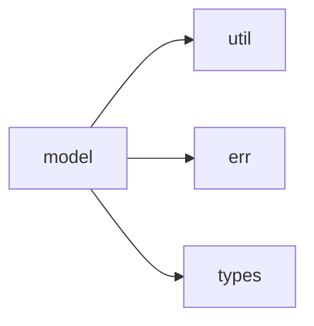

# model 模块实际结构文档

## 模块概述

model 模块定义了GXL语言的核心数据模型和组件结构，基于实际代码结构包含以下子模块：

## 实际模块结构

```
src/model/
├── mod.rs           # 模块入口
├── annotation.rs    # 注解定义
├── components/      # 组件定义目录
│   ├── mod.rs       # 组件入口
│   ├── gxl_act.rs   # 动作组件
│   ├── gxl_block.rs # 代码块组件
│   ├── gxl_cond.rs  # 条件组件
│   ├── gxl_env.rs   # 环境组件
│   ├── gxl_extend.rs # 扩展组件
│   ├── gxl_flow.rs  # 流程组件
│   ├── gxl_fun.rs   # 函数组件
│   ├── gxl_intercept.rs # 拦截器组件
│   ├── gxl_loop.rs  # 循环组件
│   ├── gxl_mod.rs   # 模块组件
│   ├── gxl_prop.rs  # 属性组件
│   ├── gxl_spc.rs   # 特殊组件
│   ├── gxl_utls.rs  # 工具组件
│   ├── gxl_var.rs   # 变量组件
│   └── prelude.rs   # 组件预导入
├── context.rs       # 上下文定义
├── data.rs          # 数据结构
├── error.rs         # 错误定义
├── execution/       # 执行模型目录
│   ├── mod.rs       # 执行模型入口
│   ├── action.rs    # 动作执行
│   ├── dict.rs      # 字典处理
│   ├── global.rs    # 全局状态
│   ├── hold.rs      # 保持状态
│   ├── job.rs       # 作业定义
│   ├── mod.rs       # 执行模块
│   ├── runnable.rs  # 可运行接口
│   ├── sequence.rs  # 序列执行
│   ├── task.rs      # 任务定义
│   ├── trans.rs     # 事务处理
│   └── unit.rs      # 单元执行
├── expect.rs        # 期望定义
├── meta.rs          # 元数据
├── primitive.rs     # 原始类型
├── sec.rs           # 安全相关
├── task_report/     # 任务报告目录
│   ├── mod.rs       # 报告入口
│   ├── main_task.rs # 主任务报告
│   ├── task_notification.rs # 任务通知
│   ├── task_rc_config.rs # 任务配置
│   └── task_result_report.rs # 结果报告
├── traits.rs        # 特质定义
└── var.rs           # 变量定义
```

## 核心数据模型

### 1. 原始类型 (primitive.rs)
定义GXL语言的基础数据类型

### 2. 变量系统 (var.rs)
变量定义和管理

### 3. 上下文系统 (context.rs)
执行上下文和环境管理

### 4. 数据结构 (data.rs)
复杂数据结构定义

### 5. 注解系统 (annotation.rs)
GXL注解定义和处理

### 6. 组件系统 (components/)
GXL语言的各种组件定义

### 7. 执行模型 (execution/)
任务、作业、事务等执行相关模型

### 8. 任务报告 (task_report/)
任务执行结果和报告系统

## 实际依赖关系



## 使用示例

```rust
use crate::model::primitive::Primitive;
use crate::model::var::Var;
use crate::model::components::gxl_flow::GxlFlow;

// 实际使用方式
let var = Var::new("name", Primitive::String("value".to_string()));
let flow = GxlFlow::new("main");
```

## 注意事项

本文档基于实际代码结构，所有列出的文件和目录都在源码中存在。model模块是项目最复杂的模块，包含了GXL语言的完整对象模型。