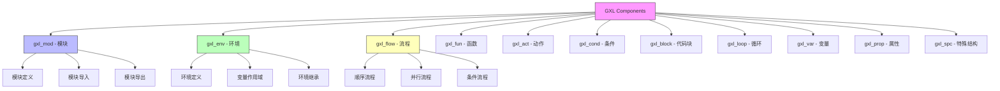
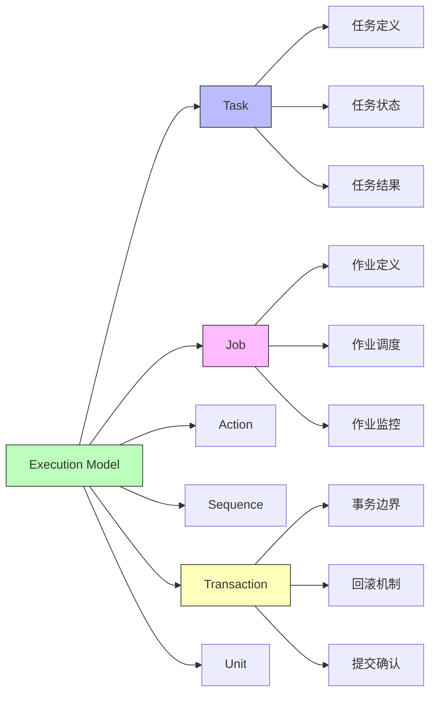
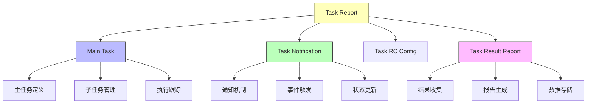
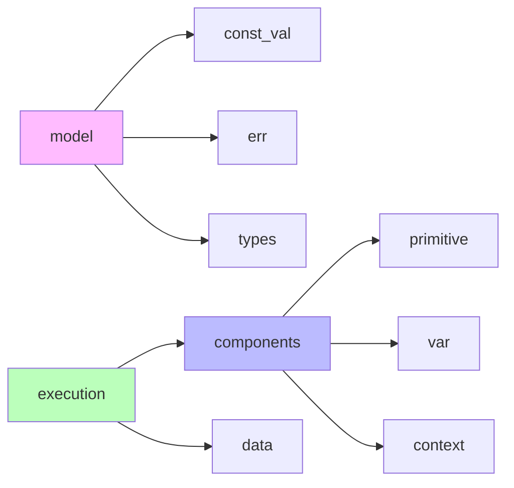

# model 模块结构文档

## 模块概述

model 模块是 galaxy-flow 的数据模型核心，定义了 GXL 语言的所有数据结构和组件模型。它提供了类型系统、执行上下文、任务模型等基础数据结构。

## 模块结构图

```mermaid
graph TD
    A[model] --> B[annotation]
    A --> C[components]
    A --> D[context]
    A --> E[data]
    A --> F[error]
    A --> G[execution]
    A --> H[expect]
    A --> I[meta]
    A --> J[primitive]
    A --> K[sec]
    A --> L[task_report]
    A --> M[traits]
    A --> N[var]

    C --> C1[gxl_act]
    C --> C2[gxl_block]
    C --> C3[gxl_cond]
    C --> C4[gxl_env]
    C --> C5[gxl_extend]
    C --> C6[gxl_flow]
    C --> C7[gxl_fun]
    C --> C8[gxl_intercept]
    C --> C9[gxl_loop]
    C --> C10[gxl_mod]
    C --> C11[gxl_prop]
    C --> C12[gxl_spc]
    C --> C13[gxl_utls]
    C --> C14[gxl_var]

    G --> G1[action]
    G --> G2[dict]
    G --> G3[global]
    G --> G4[hold]
    G --> G5[job]
    G --> G6[runnable]
    G --> G7[sequence]
    G --> G8[task]
    G --> G9[trans]
    G --> G10[unit]

    L --> L1[main_task]
    L --> L2[task_notification]
    L --> L3[task_rc_config]
    L --> L4[task_result_report]

    style A fill:#fbf,stroke:#333
    style C fill:#bbf,stroke:#333
    style G fill:#bfb,stroke:#333
    style L fill:#ffb,stroke:#333
```



## 核心数据模型

### 1. 基础类型 (primitive)
定义 GXL 语言的基础数据类型。

**主要类型：**
- 字符串类型
- 数值类型
- 布尔类型
- 空值类型

### 2. 变量模型 (var)
定义变量的存储和访问机制。

**主要功能：**
- 变量定义和存储
- 作用域管理
- 变量解析
- 环境变量集成

### 3. 上下文模型 (context)
提供执行上下文环境。

**主要功能：**
- 执行环境管理
- 变量作用域
- 错误上下文
- 调试信息

### 4. 数据模型 (data)
定义复杂数据结构。

**主要功能：**
- 列表数据结构
- 对象数据结构
- 嵌套数据支持
- 数据验证

### 5. 注解模型 (annotation)
处理 GXL 语言的注解系统。

**主要功能：**
- 注解定义
- 注解解析
- 运行时注解处理
- 元数据管理

## 组件模型详解

### GXL 组件结构



### 1. gxl_mod - 模块组件
定义 GXL 模块的结构和行为。

**主要属性：**
- 模块名称
- 导入声明
- 环境定义
- 流程定义
- 函数定义

### 2. gxl_env - 环境组件
定义执行环境和变量作用域。

**主要属性：**
- 环境名称
- 父环境引用
- 变量定义
- 配置参数

### 3. gxl_flow - 流程组件
定义可执行的流程结构。

**主要属性：**
- 流程名称
- 步骤序列
- 条件分支
- 循环结构
- 事务边界

### 4. gxl_fun - 函数组件
定义可重用的函数。

**主要属性：**
- 函数名称
- 参数列表
- 函数体
- 返回类型

### 5. gxl_act - 动作组件
定义具体的执行动作。

**主要类型：**
- 命令执行
- 函数调用
- 变量赋值
- 条件判断

## 执行模型

### 执行框架结构



### 1. Task - 任务模型
定义可执行的任务单元。

**主要属性：**
- 任务ID
- 任务类型
- 执行状态
- 输入参数
- 输出结果
- 错误信息

### 2. Job - 作业模型
定义作业的执行和管理。

**主要属性：**
- 作业ID
- 任务列表
- 执行顺序
- 依赖关系
- 执行策略

### 3. Transaction - 事务模型
定义事务边界和回滚机制。

**主要属性：**
- 事务ID
- 参与动作
- 回滚动作
- 提交状态
- 错误处理

## 任务报告系统

### 报告模型结构



## 错误处理模型

### 错误类型定义

```rust
pub enum GxlError {
    ParseError(ParseError),
    ExecutionError(ExecutionError),
    ValidationError(ValidationError),
    IoError(IoError),
    ConfigError(ConfigError),
}
```

## 使用示例

```rust
use crate::model::{
    components::gxl_flow::Flow,
    context::Context,
    data::DataValue,
    execution::task::Task
};

// 创建流程
let flow = Flow::new("example_flow");

// 创建上下文
let context = Context::new();

// 创建任务
let task = Task::new("example_task");

// 设置数据
let data = DataValue::String("Hello, World!".to_string());
```

## 依赖关系



## 扩展指南

要扩展数据模型：

1. 在相应子模块中添加新类型定义
2. 实现必要的 traits
3. 添加序列化/反序列化支持
4. 编写单元测试
5. 更新文档和示例

## 测试策略

- **单元测试**: 测试单个数据结构和组件
- **集成测试**: 测试组件间的交互
- **序列化测试**: 测试数据的序列化和反序列化
- **边界测试**: 测试极端情况和错误处理