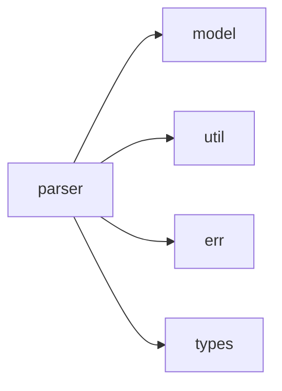

# parser 模块实际结构文档

## 模块概述

parser 模块负责解析GXL语言代码，基于实际代码结构包含以下子模块：

## 实际模块结构

```
src/parser/
├── mod.rs           # 模块入口
├── atom.rs          # 原子解析
├── code/            # 代码解析目录
│   └── mod.rs       # 代码解析入口
├── cond.rs          # 条件解析
├── context.rs       # 解析上下文
├── domain.rs        # 领域解析
├── externs.rs       # 外部定义解析
├── gxl_fun/         # GXL函数解析目录
│   └── mod.rs       # GXL函数解析
├── inner/           # 内部解析器目录
│   └── mod.rs       # 内部解析入口
├── prelude.rs       # 解析器预导入
├── stc_act.rs       # 动作结构解析
├── stc_ann.rs       # 注解结构解析
├── stc_base.rs      # 基础结构解析
├── stc_blk.rs       # 代码块结构解析
├── stc_env.rs       # 环境结构解析
├── stc_flow/        # 流程结构解析目录
│   └── mod.rs       # 流程结构解析
├── stc_mod.rs       # 模块结构解析
└── stc_spc.rs       # 特殊结构解析
```

## 实际子模块说明

### 解析核心模块
- **atom**: 解析原子表达式和基本语法单元
- **code**: 代码块解析功能
- **cond**: 条件表达式解析
- **context**: 维护解析过程中的上下文信息
- **domain**: 领域特定语法解析
- **externs**: 外部模块和定义解析
- **gxl_fun**: GXL函数定义和调用解析
- **inner**: 内部使用的解析器工具

### 结构解析模块
- **stc_act**: 解析动作(action)结构
- **stc_ann**: 解析注解(annotation)结构
- **stc_base**: 解析基础语法结构
- **stc_blk**: 解析代码块(block)结构
- **stc_env**: 解析环境(environment)定义
- **stc_flow**: 解析流程(flow)定义
- **stc_mod**: 解析模块(module)定义
- **stc_spc**: 解析特殊语法结构

## 实际依赖关系



## 使用示例

```rust
use crate::parser::stc_mod::parse_module;
use crate::parser::context::ParseContext;

// 实际使用方式
let context = ParseContext::new();
let module = parse_module(&input, &context)?;
```

## 注意事项

本文档基于实际代码结构，所有列出的文件和目录都在源码中存在。parser模块负责将GXL源代码解析为可执行的模型对象。