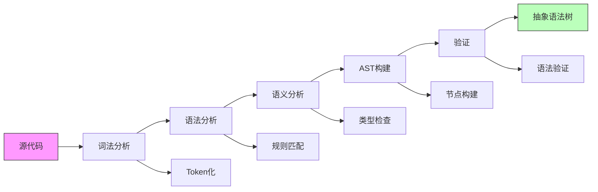
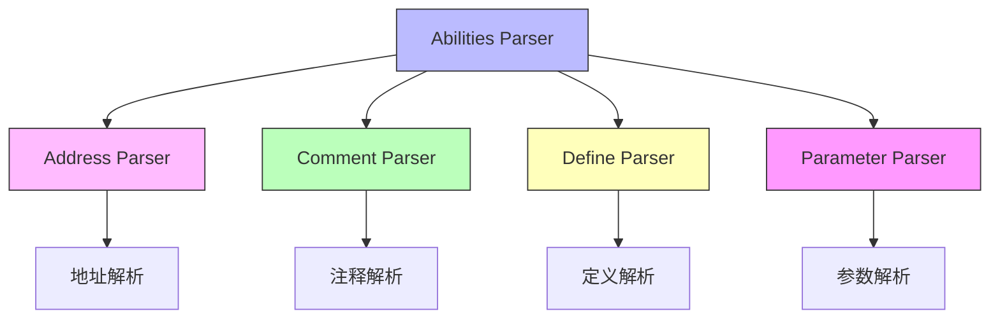
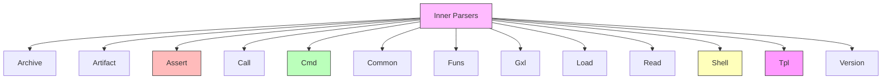
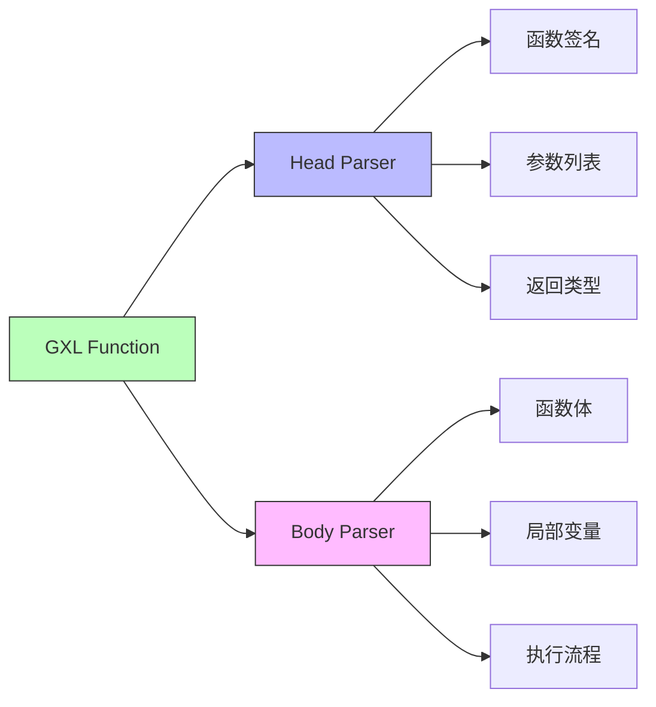
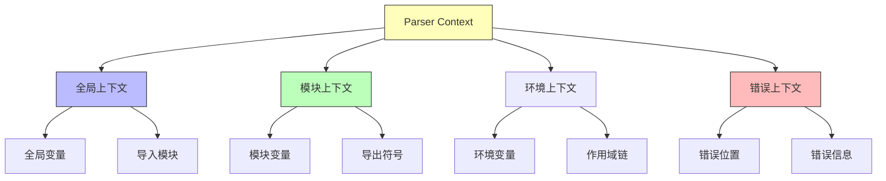
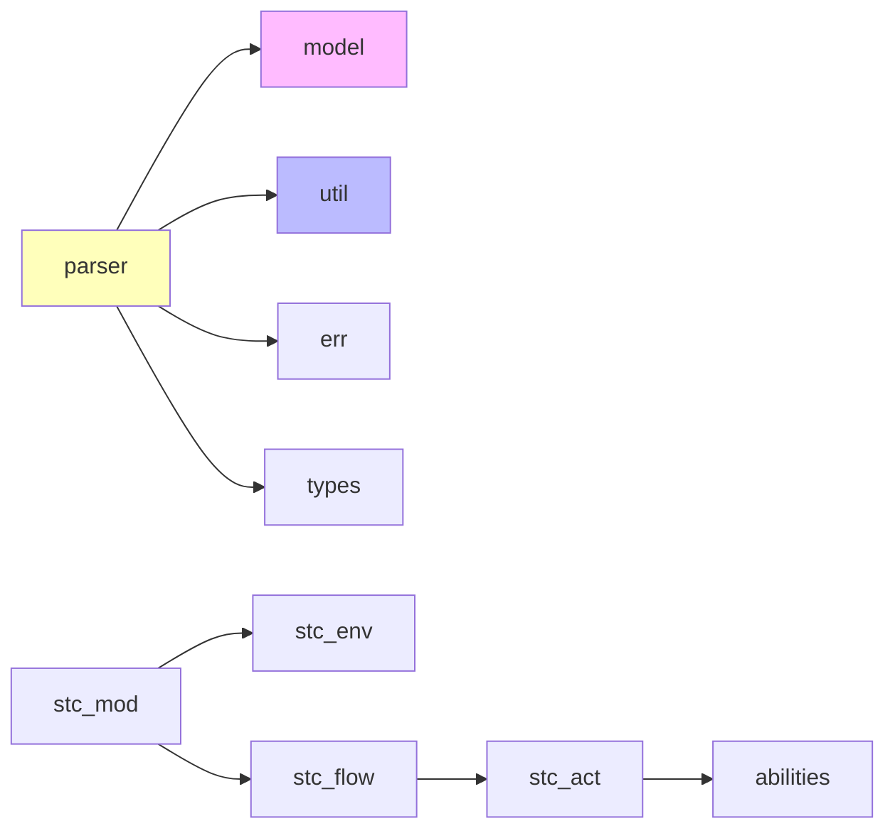

# parser 模块结构文档

## 模块概述

parser 模块是 galaxy-flow 的语言解析核心，负责将 GXL 源代码解析为抽象语法树（AST）。它实现了完整的 GXL 语言语法解析，包括模块、环境、流程、函数等各种语言结构的解析。

## 模块结构图

```mermaid
graph TD
    A[parser] --> B[atom]
    A --> C[cond]
    A --> D[context]
    A --> E[domain]
    A --> F[externs]
    A --> G[mod]
    A --> H[prelude]
    A --> I[stc_act]
    A --> J[stc_ann]
    A --> K[stc_base]
    A --> L[stc_blk]
    A --> M[stc_env]
    A --> N[stc_flow]
    A --> O[stc_mod]
    A --> P[stc_spc]
    A --> Q[abilities]
    A --> R[gxl_fun]
    A --> S[inner]

    Q --> Q1[addr]
    Q --> Q2[comment]
    Q --> Q3[define]
    Q --> Q4[param]
    Q --> Q5[prelude]

    R --> R1[body]
    R --> R2[head]

    S --> S1[archive]
    S --> S2[artifact]
    S --> S3[assert]
    S --> S4[call]
    S --> S5[cmd]
    S --> S6[common]
    S --> S7[funs]
    S --> S8[gxl]
    S --> S9[load]
    S --> S10[read]
    S --> S11[shell]
    S --> S12[tpl]
    S --> S13[ver]

    N --> N1[body]
    N --> N2[head]

    style A fill:#ffb,stroke:#333
    style Q fill:#bbf,stroke:#333
    style R fill:#bfb,stroke:#333
    style S fill:#fbf,stroke:#333
    style N fill:#f9f,stroke:#333
```



## 解析器架构

### 整体解析流程



## 核心解析组件

### 1. 基础解析器 (stc_base)
提供基础的解析功能和工具。

**主要功能：**
- 基础语法规则定义
- 通用解析工具
- 错误处理机制
- 位置信息跟踪

### 2. 模块解析器 (stc_mod)
解析 GXL 模块定义。

**解析内容：**
- 模块声明
- 导入语句
- 环境定义
- 函数定义
- 流程定义

### 3. 环境解析器 (stc_env)
解析环境定义和变量作用域。

**解析内容：**
- 环境块定义
- 变量声明
- 配置参数
- 继承关系

### 4. 流程解析器 (stc_flow)
解析流程定义和执行结构。

**解析内容：**
- 流程头部定义
- 流程体结构
- 步骤序列
- 条件分支
- 循环结构

### 5. 动作解析器 (stc_act)
解析各种执行动作。

**解析内容：**
- 命令调用
- 函数调用
- 变量赋值
- 条件判断

### 6. 注解解析器 (stc_ann)
解析 GXL 注解系统。

**解析内容：**
- 注解定义
- 注解参数
- 运行时注解
- 元数据注解

## 能力解析系统

### 能力解析结构



### 1. 地址解析器 (addr)
解析能力调用的地址信息。

**解析内容：**
- 模块路径
- 函数路径
- 相对路径
- 绝对路径

### 2. 注释解析器 (comment)
处理代码注释。

**解析内容：**
- 行注释
- 块注释
- 文档注释
- 注解注释

### 3. 定义解析器 (define)
解析变量和函数定义。

**解析内容：**
- 变量定义
- 函数定义
- 类型定义
- 常量定义

### 4. 参数解析器 (param)
解析函数和方法参数。

**解析内容：**
- 位置参数
- 命名参数
- 默认参数
- 可变参数

## 内部解析器

### 内部解析结构



### 1. 归档解析器 (archive)
解析归档相关操作。

**解析内容：**
- 归档创建
- 归档解压
- 格式指定
- 路径处理

### 2. 断言解析器 (assert)
解析断言验证操作。

**解析内容：**
- 断言条件
- 错误消息
- 断言类型
- 验证规则

### 3. 命令解析器 (cmd)
解析系统命令执行。

**解析内容：**
- 命令字符串
- 参数列表
- 环境变量
- 工作目录

### 4. Shell 解析器 (shell)
解析 Shell 命令执行。

**解析内容：**
- Shell 命令
- 脚本内容
- 交互模式
- 环境配置

### 5. 模板解析器 (tpl)
解析模板渲染操作。

**解析内容：**
- 模板字符串
- 变量替换
- 条件渲染
- 循环处理

## GXL 函数解析

### 函数解析结构



### 1. 头部解析器 (head)
解析函数头部定义。

**解析内容：**
- 函数名称
- 参数定义
- 返回类型
- 泛型参数
- 约束条件

### 2. 体部解析器 (body)
解析函数体内容。

**解析内容：**
- 局部变量
- 执行语句
- 返回值
- 错误处理

## 解析上下文

### 上下文管理



## 错误处理

### 解析错误类型

```rust
pub enum ParseError {
    SyntaxError(SyntaxError),
    SemanticError(SemanticError),
    TokenError(TokenError),
    ValidationError(ValidationError),
}
```

### 错误恢复策略

1. **同步恢复**: 使用同步标记恢复解析
2. **错误规则**: 定义错误恢复规则
3. **位置信息**: 提供精确的错误位置
4. **建议修复**: 提供可能的修复建议

## 使用示例

```rust
use crate::parser::{
    stc_mod::ModuleParser,
    stc_flow::FlowParser,
    context::ParserContext
};

// 创建解析上下文
let context = ParserContext::new();

// 解析模块
let module = ModuleParser::parse(source_code, &context)?;

// 解析流程
let flow = FlowParser::parse(flow_code, &context)?;
```

## 性能优化

### 1. 缓存机制
- 解析结果缓存
- 语法规则缓存
- 错误信息缓存

### 2. 增量解析
- 只解析变更部分
- 重用未变更的 AST 节点
- 快速错误定位

### 3. 并行解析
- 模块级并行解析
- 独立语法结构并行处理

## 依赖关系



## 扩展指南

要添加新的解析功能：

1. 在相应目录创建新的解析器模块
2. 实现 Parse trait
3. 定义语法规则
4. 添加单元测试
5. 集成到主解析流程
6. 更新文档和示例

## 测试策略

- **单元测试**: 测试单个解析规则
- **集成测试**: 测试完整语法结构
- **回归测试**: 防止语法破坏
- **性能测试**: 测试解析性能
- **错误测试**: 测试错误处理和恢复