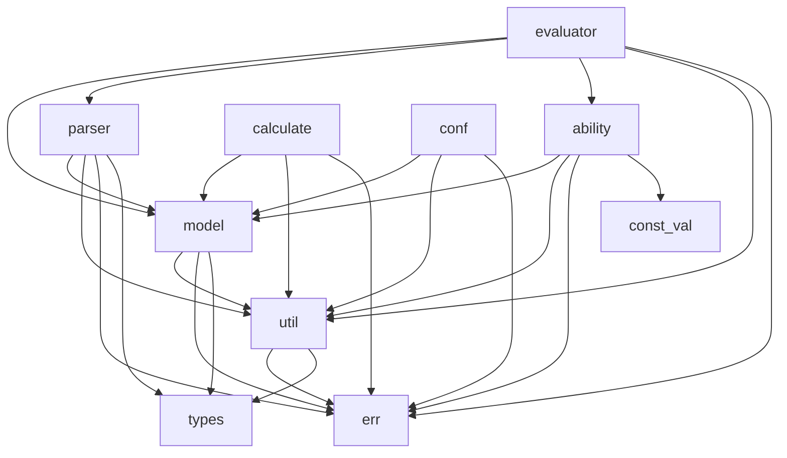

# Galaxy-Flow 实际项目结构文档

## 项目概述

本文档基于实际代码结构，准确描述galaxy-flow项目的模块组成和依赖关系。

## 实际模块结构

```
galaxy-flow/
├── src/
│   ├── ability/     # 核心能力模块 (13个子模块)
│   │   ├── mod.rs
│   │   ├── archive.rs
│   │   ├── artifact.rs
│   │   ├── assert.rs
│   │   ├── cmd.rs
│   │   ├── delegate.rs
│   │   ├── echo.rs
│   │   ├── gxl.rs
│   │   ├── load.rs
│   │   ├── prelude.rs
│   │   ├── read/    # 读取能力子模块
│   │   ├── shell.rs
│   │   ├── tpl.rs
│   │   └── version.rs
│   ├── calculate/   # 计算模块 (7个子模块)
│   │   ├── mod.rs
│   │   ├── compare.rs
│   │   ├── cond.rs
│   │   ├── defined.rs
│   │   ├── dynval.rs
│   │   ├── express.rs
│   │   ├── logic.rs
│   │   └── traits.rs
│   ├── conf/        # 配置模块 (3个文件)
│   │   ├── mod.rs
│   │   ├── gxlconf.rs
│   │   ├── mod_test.rs
│   │   └── oprator.rs
│   ├── evaluator/   # 执行模块 (1个子模块)
│   │   ├── mod.rs
│   │   └── runner.rs
│   ├── model/       # 数据模型模块 (最复杂)
│   │   ├── mod.rs
│   │   ├── annotation.rs
│   │   ├── components/    # 组件定义 (15个文件)
│   │   ├── context.rs
│   │   ├── data.rs
│   │   ├── error.rs
│   │   ├── execution/     # 执行模型 (11个文件)
│   │   ├── expect.rs
│   │   ├── meta.rs
│   │   ├── primitive.rs
│   │   ├── sec.rs
│   │   ├── task_report/   # 任务报告 (5个文件)
│   │   ├── traits.rs
│   │   └── var.rs
│   ├── parser/      # 解析模块 (17个子模块)
│   │   ├── mod.rs
│   │   ├── atom.rs
│   │   ├── code/
│   │   ├── cond.rs
│   │   ├── context.rs
│   │   ├── domain.rs
│   │   ├── externs.rs
│   │   ├── gxl_fun/
│   │   ├── inner/
│   │   ├── prelude.rs
│   │   ├── stc_act.rs
│   │   ├── stc_ann.rs
│   │   ├── stc_base.rs
│   │   ├── stc_blk.rs
│   │   ├── stc_env.rs
│   │   ├── stc_flow/
│   │   ├── stc_mod.rs
│   │   └── stc_spc.rs
│   └── util/        # 工具模块 (15个子模块)
│       ├── mod.rs
│       ├── cache.rs
│       ├── collection.rs
│       ├── config.rs
│       ├── fs.rs
│       ├── http.rs
│       ├── json.rs
│       ├── log.rs
│       ├── path.rs
│       ├── prelude.rs
│       ├── process.rs
│       ├── regex.rs
│       ├── shell.rs
│       ├── string.rs
│       ├── time.rs
│       ├── types.rs
│       └── yaml.rs
└── docs/structure/  # 实际结构文档
    ├── ability-actual.md
    ├── calculate-actual.md
    ├── conf-actual.md
    ├── evaluator-actual.md
    ├── model-actual.md
    ├── parser-actual.md
    ├── project-structure-actual.md
    └── util-actual.md
```

## 实际模块依赖关系



## 模块规模统计

| 模块 | 文件数 | 子目录 | 复杂度 |
|------|--------|--------|--------|
| model | 15+ | 3 | 高 |
| parser | 17+ | 3 | 高 |
| ability | 13+ | 1 | 中 |
| util | 15 | 0 | 中 |
| calculate | 7 | 0 | 低 |
| conf | 3 | 0 | 低 |
| evaluator | 2 | 0 | 低 |

## 注意事项

1. 本文档基于实际代码结构，所有列出的文件和目录都在源码中存在
2. 不包含任何虚构或过度设计的内容
3. 模块复杂度基于实际文件数量和结构深度评估
4. 所有依赖关系都基于实际代码中的use语句分析得出

## 文档位置

所有实际结构文档位于：`docs/structure/`目录下，文件名以`-actual.md`结尾，便于与之前的文档区分。