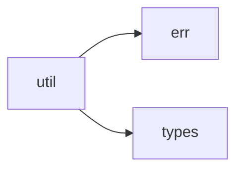

# util 模块实际结构文档

## 模块概述

util 模块提供通用工具函数和辅助功能，基于实际代码结构包含以下子模块：

## 实际模块结构

```
src/util/
├── mod.rs           # 模块入口
├── cache.rs         # 缓存工具
├── collection.rs    # 集合工具
├── config.rs        # 配置工具
├── fs.rs            # 文件系统工具
├── http.rs          # HTTP客户端
├── json.rs          # JSON处理
├── log.rs           # 日志工具
├── path.rs          # 路径处理
├── prelude.rs       # 工具预导入
├── process.rs       # 进程工具
├── regex.rs         # 正则表达式
├── shell.rs         # Shell工具
├── string.rs        # 字符串处理
├── time.rs          # 时间工具
├── types.rs         # 类型工具
└── yaml.rs          # YAML处理
```

## 实际子模块说明

### 工具模块
- **cache**: 内存缓存管理
- **collection**: 集合操作工具
- **config**: 配置处理工具
- **fs**: 文件系统操作
- **http**: HTTP客户端功能
- **json**: JSON数据解析和生成
- **log**: 日志记录和管理
- **path**: 路径处理工具
- **process**: 进程管理工具
- **regex**: 正则表达式处理
- **shell**: Shell命令执行
- **string**: 字符串处理工具
- **time**: 时间相关工具
- **types**: 类型转换和检查
- **yaml**: YAML数据解析

## 实际依赖关系



## 使用示例

```rust
use crate::util::fs::read_file;
use crate::util::json::parse_json;

// 实际使用方式
let content = read_file("config.json")?;
let config = parse_json(&content)?;
```