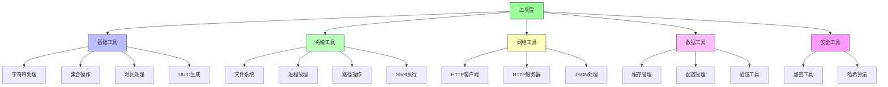
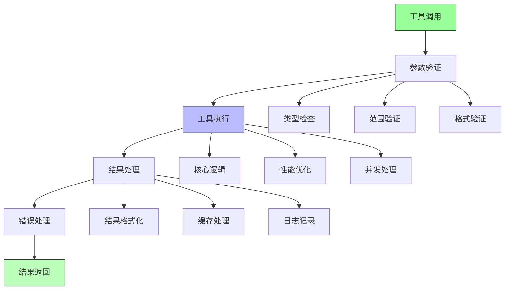
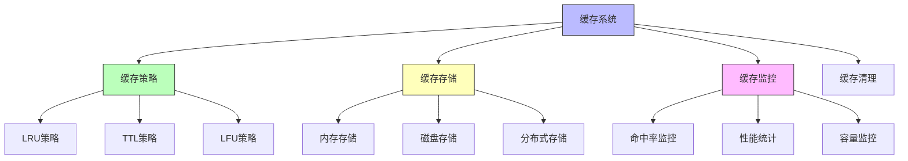
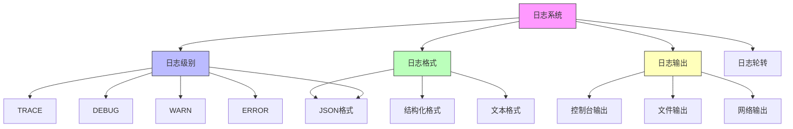
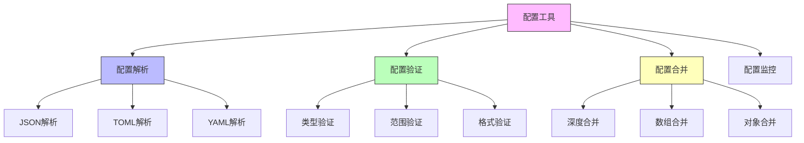
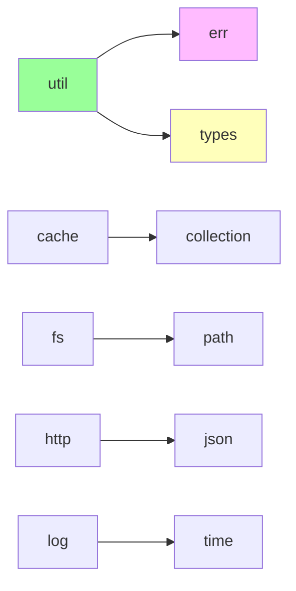

# util 模块结构文档

## 模块概述

util 模块是 galaxy-flow 的工具库和基础设施核心，提供了各种通用的工具函数、数据结构、算法实现和系统级功能。它作为整个项目的基础支撑，为其他模块提供统一的工具接口和通用功能实现。

## 模块结构图

```mermaid
graph TD
    A[util] --> B[cache]
    A --> C[collection]
    A --> D[config]
    A --> E[crypto]
    A --> F[fs]
    A --> G[http]
    A --> H[json]
    A --> I[log]
    A --> J[path]
    A --> K[process]
    A --> L[regex]
    A --> M[shell]
    A --> N[string]
    A --> O[time]
    A --> P[uuid]
    A --> Q[validation]
    A --> R[version]

    B --> B1[lru_cache]
    B --> B2[ttl_cache]

    C --> C1[hash_map]
    C --> C2[hash_set]
    C --> C3[linked_list]
    C --> C4[priority_queue]

    F --> F1[file_ops]
    F --> F2[dir_ops]
    F --> F3[path_ops]

    G --> G1[client]
    G --> G2[server]
    G --> G3[request]
    G --> G4[response]

    I --> I1[logger]
    I --> I2[level]
    I --> I3[formatter]

    style A fill:#9f9,stroke:#333
    style B fill:#bbf,stroke:#333
    style C fill:#bfb,stroke:#333
    style F fill:#ffb,stroke:#333
    style G fill:#fbf,stroke:#333
    style I fill:#f9f,stroke:#333
```



## 工具架构

### 整体工具层次



## 核心工具组件

### 1. 缓存管理 (cache)
提供高效的缓存实现。

**主要功能：**
- LRU缓存实现
- TTL缓存实现
- 缓存策略管理
- 缓存统计监控
- 并发安全

**子模块：**
- **lru_cache**: 最近最少使用缓存
- **ttl_cache**: 基于时间的缓存

### 2. 集合工具 (collection)
提供扩展的集合数据结构和操作。

**主要功能：**
- 哈希映射扩展
- 哈希集合扩展
- 链表实现
- 优先队列
- 并发集合

**子模块：**
- **hash_map**: 哈希映射工具
- **hash_set**: 哈希集合工具
- **linked_list**: 链表实现
- **priority_queue**: 优先队列

### 3. 配置工具 (config)
提供配置处理的工具函数。

**主要功能：**
- 配置解析
- 配置验证
- 配置合并
- 默认值处理
- 环境变量处理

### 4. 加密工具 (crypto)
提供加密和安全相关功能。

**主要功能：**
- 哈希算法
- 加密解密
- 签名验证
- 随机数生成
- 密钥管理

### 5. 文件系统工具 (fs)
提供文件和目录操作功能。

**主要功能：**
- 文件读写
- 目录操作
- 路径处理
- 文件监控
- 权限管理

**子模块：**
- **file_ops**: 文件操作
- **dir_ops**: 目录操作
- **path_ops**: 路径操作

### 6. HTTP工具 (http)
提供HTTP客户端和服务器功能。

**主要功能：**
- HTTP客户端
- HTTP服务器
- 请求处理
- 响应处理
- 中间件支持

**子模块：**
- **client**: HTTP客户端
- **server**: HTTP服务器
- **request**: 请求处理
- **response**: 响应处理

### 7. JSON工具 (json)
提供JSON数据处理功能。

**主要功能：**
- JSON解析
- JSON序列化
- JSON验证
- JSON路径查询
- JSON转换

### 8. 日志工具 (log)
提供统一的日志记录功能。

**主要功能：**
- 日志级别管理
- 日志格式化
- 日志输出
- 日志轮转
- 性能监控

**子模块：**
- **logger**: 日志记录器
- **level**: 日志级别
- **formatter**: 日志格式化

### 9. 路径工具 (path)
提供路径处理功能。

**主要功能：**
- 路径解析
- 路径规范化
- 路径拼接
- 路径验证
- 跨平台支持

### 10. 进程工具 (process)
提供进程管理功能。

**主要功能：**
- 进程创建
- 进程监控
- 进程通信
- 信号处理
- 资源管理

### 11. 正则表达式工具 (regex)
提供正则表达式处理功能。

**主要功能：**
- 正则编译
- 模式匹配
- 替换操作
- 分组提取
- 性能优化

### 12. Shell工具 (shell)
提供Shell命令执行功能。

**主要功能：**
- 命令执行
- 参数处理
- 输出捕获
- 错误处理
- 环境变量

### 13. 字符串工具 (string)
提供字符串处理功能。

**主要功能：**
- 字符串操作
- 格式化
- 编码转换
- 文本处理
- 模板渲染

### 14. 时间工具 (time)
提供时间处理功能。

**主要功能：**
- 时间解析
- 时间格式化
- 时间计算
- 定时器
- 性能计时

### 15. UUID工具 (uuid)
提供UUID生成功能。

**主要功能：**
- UUID生成
- UUID解析
- UUID验证
- 版本支持
- 性能优化

### 16. 验证工具 (validation)
提供数据验证功能。

**主要功能：**
- 类型验证
- 范围验证
- 格式验证
- 自定义验证
- 验证报告

### 17. 版本工具 (version)
提供版本管理功能。

**主要功能：**
- 版本解析
- 版本比较
- 版本约束
- 语义化版本
- 兼容性检查

## 工具使用架构

### 工具调用流程



## 缓存系统

### 缓存架构



### 缓存实现

```rust
pub struct LruCache<K, V> {
    capacity: usize,
    map: HashMap<K, V>,
    order: LinkedList<K>,
}

pub struct TtlCache<K, V> {
    ttl: Duration,
    map: HashMap<K, (V, Instant)>,
    cleanup_interval: Duration,
}
```

## 日志系统

### 日志架构



### 日志配置

```rust
pub struct LoggerConfig {
    pub level: LogLevel,
    pub format: LogFormat,
    pub output: LogOutput,
    pub rotation: LogRotation,
}

pub enum LogLevel {
    Trace,
    Debug,
    Info,
    Warn,
    Error,
}
```

## 配置管理

### 配置工具架构



## 使用示例

### 1. 缓存使用

```rust
use crate::util::cache::LruCache;

// 创建LRU缓存
let mut cache = LruCache::new(100);

cache.put("key1", "value1");
let value = cache.get("key1");
```

### 2. 日志使用

```rust
use crate::util::log::{Logger, LogLevel};

// 创建日志记录器
let logger = Logger::new(LogLevel::Info);

logger.info("Application started");
logger.debug("Debug message");
```

### 3. 文件操作

```rust
use crate::util::fs::{FileOps, DirOps};

// 文件操作
let content = FileOps::read("config.json")?;
FileOps::write("output.txt", "Hello World")?;

// 目录操作
DirOps::create("logs")?;
let files = DirOps::list_files("src")?;
```

### 4. HTTP客户端

```rust
use crate::util::http::client::HttpClient;

// 创建HTTP客户端
let client = HttpClient::new();

// 发送请求
let response = client.get("https://api.example.com")?;
let data = response.json()?;
```

### 5. 字符串处理

```rust
use crate::util::string::{StringUtils, Template};

// 字符串操作
let result = StringUtils::trim("  hello  ");
let template = Template::new("Hello, {name}!");
let rendered = template.render(&[("name", "World")])?;
```

### 6. 时间处理

```rust
use crate::util::time::{TimeUtils, Timer};

// 时间操作
let now = TimeUtils::now();
let formatted = TimeUtils::format(now, "%Y-%m-%d %H:%M:%S")?;

// 计时器
let timer = Timer::start();
// ... 执行操作 ...
let elapsed = timer.elapsed();
```

## 性能优化

### 1. 内存优化
- 对象池
- 内存复用
- 零拷贝操作
- 内存对齐

### 2. 并发优化
- 无锁数据结构
- 读写锁
- 原子操作
- 线程池

### 3. 缓存优化
- 多级缓存
- 预加载策略
- 缓存预热
- 缓存淘汰

## 错误处理

### 错误类型

```rust
pub enum UtilError {
    IoError(std::io::Error),
    JsonError(serde_json::Error),
    HttpError(reqwest::Error),
    ValidationError(String),
    CacheError(String),
    ConfigError(String),
}
```

## 依赖关系



## 扩展指南

要添加新的工具功能：

1. 在util目录下创建新的工具模块
2. 实现工具接口
3. 添加单元测试
4. 更新文档和示例
5. 添加性能测试
6. 添加集成测试

## 测试策略

- **单元测试**: 测试单个工具函数
- **集成测试**: 测试工具组合使用
- **性能测试**: 测试工具性能
- **并发测试**: 测试并发安全性
- **边界测试**: 测试边界条件
- **错误测试**: 测试错误处理
- **兼容性测试**: 测试跨平台兼容性