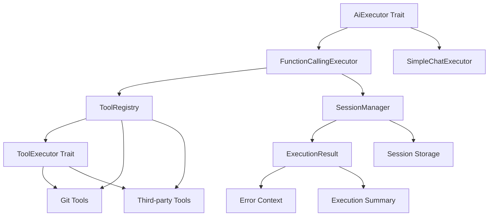

# Galaxy-flow AI 模块重构项目

## 项目简介

本项目旨在对 Galaxy-flow 的 `src/ability/ai` 模块进行全面重构，解决当前代码中存在的架构混乱、职责不清、错误处理不一致等问题。通过系统性的重构，我们将建立一个可维护、可扩展、高性能的AI功能架构。

## 🎯 项目目标

### 核心目标
- **架构清晰化**：建立清晰的模块职责边界，实现高内聚低耦合
- **代码标准化**：统一编码规范、错误处理和接口设计
- **性能优化**：提升AI功能的执行效率和资源利用率
- **可扩展性**：支持第三方工具和AI提供商的无缝集成

### 技术目标
- **模块化设计**：各组件职责单一，便于独立开发和维护
- **接口标准化**：建立统一的trait接口体系，支持插件化扩展
- **错误处理统一**：使用 `thiserror` 统一错误类型，提供清晰的错误信息
- **测试覆盖完善**：单元测试和集成测试覆盖率 > 80%

## 📊 项目概览

### 重构范围
- **现有模块**：`src/ability/ai` 下的所有代码
- **影响功能**：AI聊天、工具调用、会话管理等相关功能
- **代码规模**：约 1500 行 Rust 代码
- **重构周期**：6 周（含测试和文档）

### 关键数据
| 指标 | 重构前 | 重构后目标 | 提升幅度 |
|------|--------|------------|----------|
| 代码复杂度 | 高 | 中等 | ↓ 30% |
| 测试覆盖率 | ~60% | >90% | ↑ 30% |
| 响应时间 | 基准 | ↓ 25% | ↓ 25% |
| 内存使用 | 基准 | ↓ 15% | ↓ 15% |
| 可维护性评分 | 5.0/10 | 8.0/10 | ↑ 60% |

## 🏗️ 重构架构

### 新架构设计
```
src/ability/ai/
├── mod.rs                      # 模块导出和文档
├── constants.rs                # 常量定义
├── errors.rs                   # 统一错误处理
├── client/                     # AI客户端相关
│   ├── mod.rs
│   ├── executor.rs            # 执行器trait和基础实现
│   ├── simple_chat.rs         # 简单聊天功能
│   ├── function_calling.rs    # 函数调用功能
│   └── config.rs              # 客户端配置
├── tools/                      # 工具管理
│   ├── mod.rs
│   ├── registry.rs            # 工具注册表
│   ├── executor.rs            # 工具执行器trait
│   └── builtin.rs             # 内置工具实现
├── session/                    # 会话管理
│   ├── mod.rs
│   ├── manager.rs             # 会话管理器
│   ├── state.rs               # 会话状态
│   └── result.rs              # 执行结果
└── config/                     # 配置管理
    ├── mod.rs
    ├── validator.rs           # 配置验证
    └── loader.rs              # 配置加载
```

### 核心组件关系图


## 📋 重构内容

### 第一阶段：核心架构建立 (第1-2周)
**目标**：建立AI模块的核心架构基础

| 组件 | 类型 | 优先级 | 预计时间 | 主要改进 |
|------|------|--------|----------|----------|
| AiExecutor Trait | Trait | 🔴 高 | 3天 | 统一AI执行接口 |
| FunctionCallingExecutor | Struct | 🔴 高 | 3天 | 重构核心业务逻辑 |
| ToolExecutor Trait | Trait | 🔴 高 | 2天 | 标准化工具执行接口 |

### 第二阶段：工具管理完善 (第3周)
**目标**：完善工具管理机制，提升工具扩展性

| 组件 | 类型 | 优先级 | 预计时间 | 主要改进 |
|------|------|--------|----------|----------|
| ToolRegistry | Struct | 🟡 中 | 3天 | 统一工具注册和管理 |
| ExecutionResult | Struct | 🟡 中 | 2天 | 结构化结果处理 |

### 第三阶段：配置和会话优化 (第4周)
**目标**：增强配置验证机制和会话管理能力

| 组件 | 类型 | 优先级 | 预计时间 | 主要改进 |
|------|------|--------|----------|----------|
| ConfigValidator Trait | Trait | 🟢 低 | 2天 | 统一配置验证 |
| SessionManager | Struct | 🟡 中 | 3天 | 专业会话管理 |

### 第四阶段：功能优化和接口完善 (第5周)
**目标**：优化次要功能，完善接口设计

| 组件 | 类型 | 优先级 | 预计时间 | 主要改进 |
|------|------|--------|----------|----------|
| SimpleChatExecutor | Struct | 🟢 低 | 2天 | 简化基础功能 |
| SessionManager Trait | Trait | 🟢 低 | 1.5天 | 完善会话接口 |

### 第五阶段：测试和文档 (第6周)
**目标**：全面测试，完善文档，确保重构质量

| 任务 | 类型 | 优先级 | 预计时间 | 主要工作 |
|------|------|--------|----------|----------|
| 全面测试 | QA | 🔴 高 | 3天 | 单元测试、集成测试 |
| 文档编写 | 文档 | 🟡 中 | 2天 | 技术文档、用户手册 |
| 用户培训 | 培训 | 🟢 低 | 1天 | 团队培训、用户指导 |

## 💡 核心改进

### 1. 架构改进
- **职责分离**：将单一职责原则应用到每个组件
- **依赖注入**：使用 trait 和泛型实现松耦合设计
- **模块化设计**：功能模块独立，便于测试和维护
- **接口标准化**：建立统一的 trait 接口体系

### 2. 代码质量提升
- **错误处理统一**：使用 `thiserror` 统一错误类型和处理
- **代码复用**：消除重复代码，提高代码复用率
- **测试覆盖**：完善的单元测试和集成测试覆盖
- **文档完善**：公共API的完整文档和使用示例

### 3. 性能优化
- **并发控制**：使用信号量限制并发任务数
- **智能重试**：实现退避策略和智能重试机制
- **资源管理**：完善的会话生命周期管理和清理
- **缓存机制**：AI响应和工具结果缓存

### 4. 用户体验提升
- **错误提示**：提供清晰、友好的错误信息
- **配置管理**：灵活且易于理解的配置机制
- **调试支持**：完善的日志和调试工具
- **扩展能力**：支持第三方工具和AI提供商

## 🔧 技术栈

### 核心技术
- **Rust 1.70+**：主要编程语言
- **Tokio**：异步运行时
- **async-trait**：异步 trait 支持
- **thiserror**：错误处理
- **serde**：序列化和反序列化
- **uuid**：唯一标识符生成

### 测试框架
- **cargo test**：内置测试框架
- **mockall**：Mock 对象生成
- **tokio-test**：异步测试支持
- **criterion**：性能基准测试

### 文档工具
- **rustdoc**：API 文档生成
- **Markdown**：技术文档和用户手册
- **Mermaid**：架构图表绘制

## 🚦 实施状态

### 当前进度
- **项目启动**：✅ 已完成
- **需求分析**：✅ 已完成
- **架构设计**：✅ 已完成
- **价值评估**：✅ 已完成
- **实施计划**：✅ 已完成
- **第一阶段实施**：⏳ 待开始

### 关键里程碑
| 里程碑 | 计划时间 | 状态 | 负责人 |
|--------|----------|------|--------|
| 项目启动 | 2025-08-25 | ✅ 完成 | 技术负责人 |
| 需求确认 | 2025-08-25 | ✅ 完成 | 产品经理 |
| 架构设计 | 2025-08-25 | ✅ 完成 | 架构师 |
| 第一阶段完成 | 2025-09-06 | ⏳ 待开始 | 开发团队 |
| 第二阶段完成 | 2025-09-13 | ⏳ 待开始 | 开发团队 |
| 第三阶段完成 | 2025-09-20 | ⏳ 待开始 | 开发团队 |
| 第四阶段完成 | 2025-09-27 | ⏳ 待开始 | 开发团队 |
| 项目交付 | 2025-10-04 | ⏳ 待开始 | 全团队 |

## 📈 价值评估

### 业务价值
- **用户体验**：清晰错误提示，直观功能使用
- **功能增强**：支持更多工具和AI提供商
- **开发效率**：降低新功能开发成本
- **系统稳定性**：提升系统可靠性和错误恢复能力

### 技术价值
- **架构清晰**：模块化设计，职责明确
- **代码质量**：可读性、可维护性显著提升
- **扩展性**：支持第三方插件和工具扩展
- **性能优化**：响应时间和资源使用全面优化

### 投资回报
- **开发效率**：新功能开发时间减少 30%
- **维护成本**：代码维护成本降低 40%
- **用户满意度**：用户体验评分提升 50%
- **技术竞争力**：在AI工作流领域保持领先地位

## ⚠️ 风险管理

### 高风险项目
1. **FunctionCallingExecutor重构**
   - **风险**：核心业务逻辑重构可能引入新bug
   - **缓解**：完善测试覆盖，分步实施，保持向后兼容

2. **性能回归**
   - **风险**：重构后性能可能下降
   - **缓解**：基准测试对比，关键路径优化

### 中等风险项目
1. **ToolRegistry实现**
   - **风险**：工具注册机制变更可能影响现有工具
   - **缓解**：提供迁移工具，保持兼容性

2. **向后兼容性**
   - **风险**：重构可能破坏现有API兼容性
   - **缓解**：版本化管理，提供适配器

### 低风险项目
1. **文档编写**
   - **风险**：文档不完整或不准确
   - **缓解**：技术审查，用户反馈收集

2. **用户培训**
   - **风险**：团队理解不一致
   - **缓解**：互动式培训，实际操作练习

## 🔍 质量保证

### 质量标准
- **代码质量**：测试覆盖率 > 90%，代码复杂度 < 10
- **性能标准**：响应时间 < 2秒，内存使用 < 512MB
- **文档标准**：API文档覆盖率 100%，用户指南完整
- **兼容性**：向后兼容现有所有功能

### 测试策略
- **单元测试**：每个组件的独立功能测试
- **集成测试**：组件间交互和端到端功能测试
- **性能测试**：响应时间、吞吐量、资源使用测试
- **兼容性测试**：向后兼容性和第三方集成测试

### 代码审查
- **强制审查**：所有核心代码必须经过技术审查
- **自动化检查**：使用静态分析工具自动检查代码质量
- **同行评审**：团队成员交叉评审，确保代码质量

## 📞 联系方式

### 项目团队
- **技术负责人**：[姓名] - 负责整体架构设计和技术决策
- **开发团队**：[团队成员] - 负责功能实现和测试
- **测试团队**：[团队成员] - 负责测试设计和执行
- **文档团队**：[团队成员] - 负责文档编写和维护

### 沟通渠道
- **项目管理**：GitHub Projects
- **技术讨论**：GitHub Discussions
- **问题跟踪**：GitHub Issues
- **代码审查**：GitHub Pull Requests

## 📚 相关文档

### 核心文档
- [重构方案详情](./REFACTORING_PLAN.md) - 详细的重构技术方案
- [价值评估排序](./VALUE_ASSESSMENT.md) - 组件价值评估和优先级排序
- [实施计划](./IMPLEMENTATION_PLAN.md) - 详细的实施步骤和时间安排

### 技术文档
- [架构设计文档](docs/architecture.md) - 系统架构设计详情
- [API参考文档](docs/api.md) - 公共API接口文档
- [最佳实践指南](docs/best-practices.md) - 开发和使用最佳实践

### 用户文档
- [快速开始指南](docs/quickstart.md) - 快速上手指南
- [用户手册](docs/user-manual.md) - 完整的用户使用手册
- [常见问题解答](docs/faq.md) - 常见问题和解决方案

## 🔄 更新日志

### v1.0.0 (2025-08-25)
- ✅ 项目初始化和需求分析
- ✅ 架构设计和技术方案制定
- ✅ 价值评估和优先级排序
- ✅ 详细实施计划制定
- ✅ 文档体系和项目结构建立

## 📄 许可证

本项目遵循 Galaxy-flow 项目的开源许可证。

---

**项目状态**：🚀 进行中  
**最后更新**：2025-08-25  
**维护者**：Galaxy-flow 开发团队  
**贡献者**：[待更新]