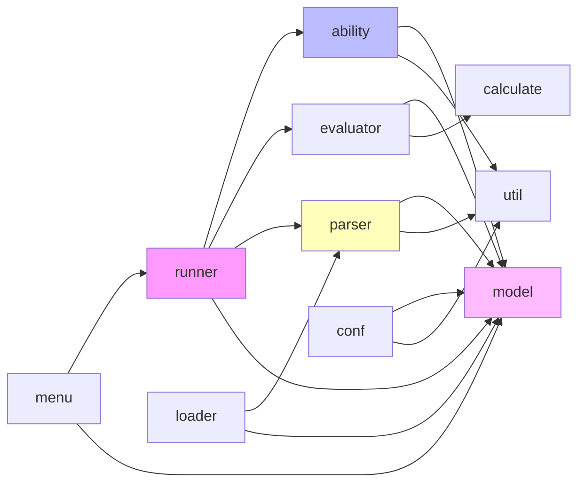

# 模块结构设计文档

## 项目概述

galaxy-flow 是一个基于 Rust 的 GXL (Galaxy eXtension Language) 解释器和执行引擎，用于处理配置文件和工作流定义。

## 模块结构总览

项目主要包含以下核心模块：

```mermaid
graph TD
    A[galaxy-flow] --> B[ability]
    A --> C[calculate]
    A --> D[conf]
    A --> E[evaluator]
    A --> F[model]
    A --> G[parser]
    A --> H[util]
    A --> I[runner]
    A --> J[loader]
    A --> K[menu]

    B --> B1[archive]
    B --> B2[assert]
    B --> B3[cmd]
    B --> B4[echo]
    B --> B5[gxl]
    B --> B6[load]
    B --> B7[read]
    B --> B8[shell]
    B --> B9[tpl]

    C --> C1[compare]
    C --> C2[cond]
    C --> C3[express]
    C --> C4[logic]

    F --> F1[annotation]
    F --> F2[components]
    F --> F3[context]
    F --> F4[data]
    F --> F5[execution]
    F --> F6[task_report]

    G --> G1[abilities]
    G --> G2[gxl_fun]
    G --> G3[inner]
    G --> G4[stc_flow]

    style A fill:#f9f,stroke:#333
    style B fill:#bbf,stroke:#333
    style C fill:#bfb,stroke:#333
    style F fill:#fbf,stroke:#333
    style G fill:#ffb,stroke:#333
```

## 模块职责说明

### 1. ability 模块
负责定义和执行各种能力（abilities），包括：
- **archive**: 归档处理能力
- **assert**: 断言验证能力
- **cmd**: 命令执行能力
- **echo**: 输出能力
- **gxl**: GXL 相关能力
- **load**: 加载能力
- **read**: 读取文件能力
- **shell**: Shell 命令执行能力
- **tpl**: 模板处理能力

### 2. calculate 模块
负责表达式计算和逻辑处理：
- **compare**: 比较运算
- **cond**: 条件判断
- **express**: 表达式解析
- **logic**: 逻辑运算

### 3. conf 模块
配置文件处理：
- **gxlconf**: GXL 配置管理
- **oprator**: 配置操作器

### 4. evaluator 模块
表达式求值器：
- **env_exp**: 环境表达式求值
- **mod**: 求值器主模块

### 5. model 模块
数据模型定义：
- **annotation**: 注解模型
- **components**: 组件模型（包含 GXL 各种组件）
- **context**: 上下文模型
- **data**: 数据模型
- **execution**: 执行模型
- **task_report**: 任务报告模型

### 6. parser 模块
GXL 语言解析器：
- **abilities**: 能力解析
- **gxl_fun**: GXL 函数解析
- **inner**: 内部解析器
- **stc_flow**: 流程结构解析

### 7. util 模块
工具类和辅助功能：
- **git**: Git 操作工具
- **path**: 路径处理工具
- **shell**: Shell 工具
- **str_utils**: 字符串工具

## 模块间依赖关系

## 设计原则

1. **单一职责原则**: 每个模块专注于特定的功能领域
2. **依赖倒置**: 高层模块不依赖低层模块的具体实现
3. **接口隔离**: 模块间通过清晰的接口进行交互
4. **可扩展性**: 模块设计支持未来功能的扩展

## 后续计划

1. 为每个模块创建详细的结构文档
2. 添加模块间的交互时序图
3. 完善每个模块的API文档
4. 添加模块测试用例